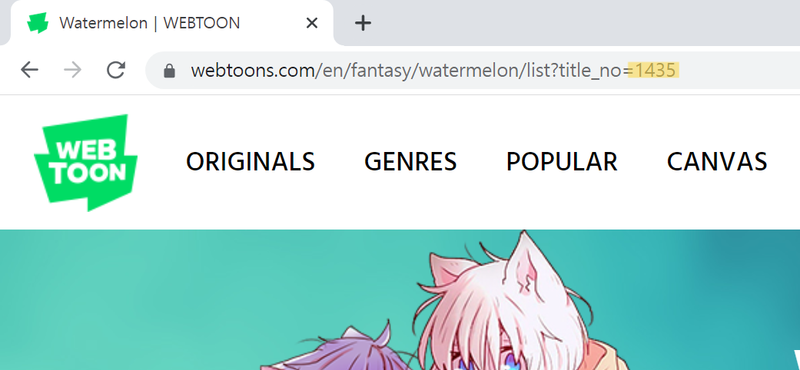
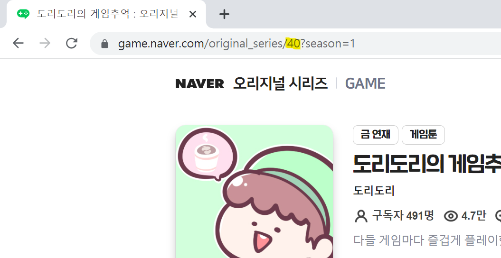
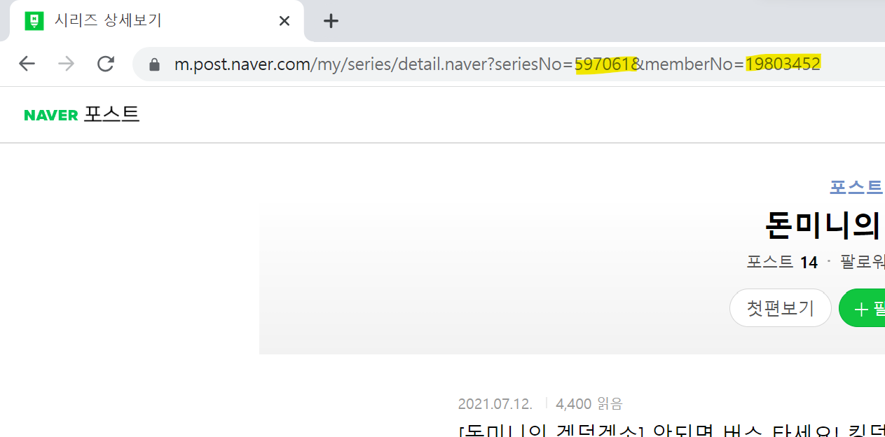

# WebtoonScraper
[](https://pypi.org/project/WebtoonScraper/)

국내 최대 규모 오픈 소스 웹툰 스크래퍼입니다.

네이버 웹툰, 베스트 도전만화, 웹툰 오리지널, 웹툰 캔버스, 만화경, 버프툰, 네이버 포스트, 네이버 게임, 레진 코믹스를 지원하고,
이외에도 더 많은 웹툰을 추후에 지원할 예정입니다.

# Disclaimer
> 제30조(사적이용을 위한 복제) 공표된 저작물을 영리를 목적으로 하지 아니하고 개인적으로 이용하거나 가정 및 이에 준하는 한정된 범위 안에서 이용하는 경우에는 그 이용자는 이를 복제할 수 있다. 다만, 공중의 사용에 제공하기 위하여 설치된 복사기기, 스캐너, 사진기 등 문화체육관광부령으로 정하는 복제기기에 의한 복제는 그러하지 아니하다.  <개정 2020. 2. 4.>

저작권법에는 사적 복제를 허용하는 조항이 있으며, 이 경우에는 저작권법을 위배하지 않고 이 프로그램을 사용할 수 있습니다.

사적 이용을 하더라도 이용 약관 위반으로 인해 계정 정지 등의 제재를 받을 가능성이 있으며, 기타 법적 리스크 역시 존재합니다.
개발자는 소프트웨어를 '있는 그대로(AS-IS)' 제공하며, 사용자가 소프트웨어를 사용함에 따른 위험은 사용자의 책임하에 있습니다.

만약 자신이 한국 국민이 아니거나 법 시행 전이었다면 해당 법률의 적용을 받지 않을 수도 있습니다. 이러한 점에 대해선 스스로 확인하시기 바랍니다.

# 시작하기

1. 파이썬을 설치합니다.
2. 터미널에서 다음과 같은 명령어를 실행합니다.
   ```
   pip install -U WebtoonScraper
   ```

# 네이버 웹툰, 베스트 도전만화, 웹툰 오리지널, 웹툰 캔버스, 만화경, 네이버 게임 다운로드하기

버프툰과 네이버 포스트는 아래로 가서 확인하세요.

1. 원하는 웹툰으로 가서 titleid 또는 title_no를 복사하세요.

   [네이버 웹툰/베스트 도전](https://comic.naver.com):
   
   [웹툰 오리지널/캔버스](https://webtoons.com):
   
   [만화경](https://manhwakyung.com)
   
   [네이버 게임 오리지널 시리즈](https://game.naver.com/original_series):
   
   버프툰과 네이버 포스트는 아래의 '버프툰 다운로드하기'섹션과 '네이버 포스트 다운로드하기' 섹션을 참고해 주세요.
   레진코믹스는 따로 준비된 스크린샷은 없습니다만 방법은 네이버 게임 오리지널과 같습니다.
   레진코믹스는 titleid가 문자열이라는 점에 참고하세요.
2. 다음의 파이썬 코드를 웹툰이 다운로드되길 원하는 폴더 내에서 실행해 주세요. 웹툰은 정식 연재와 베스트 도전, Webtoons 오리지널과 캔버스, 만화경, 네이버 게임 모두 가능합니다.

   ```python
   from WebtoonScraper import Webtoon as wt

   # 네이버 웹툰
   wt.get_webtoon(76648, wt.N)  # titleid를 여기에다 붙여넣으세요.
   # 베스트 도전만화
   wt.get_webtoon(763952, wt.B)  # titleid를 여기에다 붙여넣으세요.  # ! 수정
   # 웹툰 오리지널
   wt.get_webtoon(1435, wt.O)  # title_no를 여기에다 붙여넣으세요.
   # 웹툰 캔버스
   wt.get_webtoon(304446, wt.C)  # title_no를 여기에다 붙여넣으세요.
   # 만화경
   wt.get_webtoon(146, wt.M)  # titleid를 여기에다 붙여넣으세요. Webtoon.T 태그도 사용 가능합니다.
   # 네이버 게임 오리지널 시리즈
   wt.get_webtoon(5, wt.G)  # titleid를 여기에다 붙여넣으세요.
   # 버프툰
   cookie = 'cookie here'  # cookie를 여기에다 붙여넣으세요. 자세한 설명은 아래의 '버프툰 다운로드하기'를 참고하세요.
   wt.get_webtoon(1007888, wt.BF, cookie=cookie)  # titleid를 여기에다 붙여넣으세요.
   # 네이버 포스트
   wt.get_webtoon((597061, 19803452), wt.P)  # seriesNo와 memberNo를 각각 붙여넣으세요. 자세한 설명은 아래의 '네이버 포스트 다운받기'를 참고하세요.
   # 레진코믹스
   authorization = 'authorization here'  # authorization을 여기에다 붙여넣으세요. 자세한 설명은 아래의 '레진코믹스 다운로드하기'를 참고하세요.
   wt.get_webtoon('some_webtoon', wt.L, authorization=authorization)  # titleid를 여기에다 붙여넣으세요.
   ```

   이제 웹툰이 webtoons 폴더에 다운로드됩니다.

   cf. 웹툰 태그를 생략하면 해당 웹툰이 어떤 사이트의 웹툰 id인지 자동으로 알아냅니다. 만약 몇몇 태그가 겹친다면 태그에 맞는 수를 입력하는 창에 알맞은 수를 입력하면 됩니다.

   episode_no_range 키워드를 이용하면 특정한 에피소드만 다운로드받을 수 있습니다.

   ```python
   wt.get_webtoon(5, wt.G, episode_no_range=(1,20))  # 1화부터 20화까지
   ```

   merge 키워드를 이용하면 webtoon 폴더 내에 있는 모든 웹툰을 원하는 개수 만큼 묶습니다.

   ```python
   wt.get_webtoon(5, wt.G, merge=5)
   ```
3. 만화 뷰어 앱을 통해 다운로드한 웹툰을 시청할 수 있습니다.

## 주의사항

* 중간에 웹툰 다운로드가 멈춘 듯이 보여도 정상입니다. 그대로 가만히 있으면 다운로드가 다시 진행됩니다.
* 만약 작동하지 않는다면 윈도우에서 Python 3.11.4을 설치하고 앞의 과정을 반복해 보세요.

# 버프툰 다운로드하기

## 로그인하지 않은 상태에서 웹툰 다운로드하기

로그인하지 않은 상태에서도 웹툰을 다운로드받을 수 있으나, 받을 수 있는 웹툰 수가 매우 적기에 추천하지 않습니다.

1. 웹툰 페이지에 들어가 주소창의 맨 마지막 수를 복사합니다.
2. 다음의 파이썬 코드를 웹툰이 다운로드되길 원하는 폴더 내에서 실행해 주세요.
   ```python
   from WebtoonScraper import Webtoon as wt

   wt.get_webtoon(1007888, wt.BF)  # 복사했던 수를 여기에다 붙여넣으세요.
   ```
3. 'Enter cookie of 1007888(시리즈 id) (Enter nothing to preceed without cookie)'라는 문구와 함께 입력란이 나오면 그냥 enter를 눌러줍니다.
4. 로그인하지 않고 볼 수 있는 모든 에피소드가 다운로드됩니다.

## 로그인한 상태에서 웹툰 다운로드하기

이 과정은 PC를 기준으로 설명합니다. 만약 모바일이라면 Kiwi Browser 등을 통해 다음의 과정을 수행할 수 있습니다.

1. 웹툰 페이지에 들어가 주소창의 맨 마지막 수를 복사합니다. 이 예시에서는 1007888입니다.
   
2. 로그인을 하고 f12를 누르고 네트워크 창을 연 뒤 웹툰 페이지에 들어갑니다.
   
3. 새로고침을 한 뒤 '이름'에 있는 favicon.ico 요청을 클릭하고 나온 창에 '헤더' 탭을 엽니다.
   
4. 내려서 Cookie: 라고 되어 있는 모든 내용을 복사합니다.
   
5. 다음의 파이썬 코드를 웹툰이 다운로드되길 원하는 폴더 내에서 실행해 주세요.
   ```python
   from WebtoonScraper import Webtoon as wt
   cookie = '두 번째로 복사했던 문자를 여기에다 붙여넣으세요.'
   wt.get_webtoon(1007888, wt.BF, cookie=cookie)  # 첫 번째로 복사했던 수를 여기에다 붙여넣으세요.
   ```
6. 로그인하면 볼 수 있는 모든 에피소드가 다운로드됩니다.

## 주의사항

* get_webtoon에서 cookie를 입력하면 자동으로 버프툰으로 인식합니다.
* favicon.ico가 요청에 뜨지 않는다면 ctrl+R을 해보고, 그래도 없다면 `필터`에서 `모두`로 설정되어 있는지 다시 확인하세요.

# 네이버 포스트 다운로드하기

1. 웹툰이 있는 페이지로 가서 주소창에서 seriesNo와 memberNo를 복사하세요. 예시에서는 각각 597061과 19803452입니다.
   
2. 다음의 파이썬 코드를 웹툰이 다운로드되길 원하는 폴더 내에서 실행해 주세요.
   ```python
   from WebtoonScraper import Webtoon as wt

   wt.get_webtoon((597061, 19803452), wt.P)  # 여기에 아까 복사한 seriesNo와 memberNo를 붙여넣으세요.
   ```
3. 만화 뷰어 앱을 통해 다운로드한 웹툰을 시청할 수 있습니다.

## 주의사항

* 가끔씩 이유 없는 오류가 발생할 수 있습니다. 그럴 때는 조금 시간이 지난 후에 다시 시도해 보세요.
* tuple를 입력하면 자동으로 포스트로 인식됩니다.

# 레진코믹스 다운로드하기

로그인하지 않은 상태에서도 웹툰을 다운로드받을 수 있으나, 받을 수 있는 에피소드의 개수가 제한된다는 점을 유의해 주십세요.
로그인하지 않은 상태이더라도 웹툰을 다운로드받을 수는 있습니다.

1. 웹툰 페이지에 들어가 주소창의 맨 마지막 문자열을 복사합니다.
2. 로그인을 하고 f12를 누르고 네트워크 창을 연 뒤 웹툰 페이지에 들어갑니다.
3. 새로고침을 한 뒤 '이름'에 있는 `balance?lezhinObjectId=...&lezhinObjectType=comic`(찾기 조금 어려울 수 있습니다.) 요청을 클릭하고 나온 창에 '헤더' 탭을 엽니다.
4. 내려서 Authorization: 이라고 되어 있는 모든 내용을 복사합니다.
5. 다음의 파이썬 코드를 웹툰이 다운로드되길 원하는 폴더 내에서 실행해 주세요.
   ```python
   from WebtoonScraper import Webtoon as wt
   authorization = '두 번째로 복사했던 문자를 여기에다 붙여넣으세요.'
   wt.get_webtoon(1007888, wt.L, authorization=authorization)  # 첫 번째로 복사했던 수를 여기에다 붙여넣으세요.
   ```
6. 로그인하면 볼 수 있는 모든 에피소드가 다운로드됩니다.

## 주의사항

* 다른 웹툰 플렛폼과는 다르게 titleid가 문자열입니다.
* 다른 웹툰 플랫폼들에 비해 다운로드 속도가 비교적 느린 편입니다.
* 일부 웹툰은 셔플링이 되어 있습니다. 따라서 웹툰을 다 다운로드받은 후 언셔플링을 하는 과정이 필요하며, 이 과정에 다소 시간이 소요된다는 점 참고 바랍니다.

# 여러 회차 하나로 묶기

1. 웹툰을 상기한 대로 다운로드받습니다.
2. 다음과 같이 코드를 짭니다.
   ```python
   from WebtoonScraper import FolderMerger

   fm = FolderMerger()
   fm.divide_all_webtoons(5)
   ```
3. webtoons 폴더에 있는 **모든** 웹툰이 'webtoon_merge' 폴더에 5화씩 묶여져 다운로드됩니다.

## 주의사항

* 시작 시 꼭 디렉토리를 선택해 주세요. 아니면 오류가 납니다.
* 작업 중간에 폴더가 사라지고 이미지가 폴더 밖으로 나오는데, 이는 정상 과정입니다.
* 너무 큰 수를 입력하면 웹툰 뷰어가 제대로 작동하지 않을 수 있음을 유의하세요.

# 묶인 회차 다시 원래대로 되돌리기

1. 윗글의 기능으로 묶인 회차를 준비합니다.
2. 다음과 같이 코드를 짭니다.
   ```python
   from WebtoonScraper import FolderMerger

   fm= FolderMerger()
   fm.restore_webtoons_in_directory()
   ```
3. 'webtoon' 폴더에 있던 모든 웹툰이 웹툰을 처음 다운로드했던 상태로 되돌아갑니다.

# Relese Note

1.2.0 (Jul 27, 2023): 레진코믹스 추가, 의존성 증가(pyjsparser, Pillow)

1.1.1 (Jul 22, 2023): 내부 모듈 이름 변경, merge option 추가, abstractmethod들의 일반 구현 추가

1.0.2 (Jul 7, 2023): 대형 리팩토링, get_webtoon_platform 비동기 방식으로 속도 개선, 상대경로로 변경, 테스트 추가

1.0.1 (Jun 30, 2023): 코드 개선 및 리팩토링, api를 통한 로직으로 변경 (버그가 많기에 사용을 권장하지 않음)

1.0.0 (Jun 29, 2023): 네이버 게임 추가, FolderManager 리펙토링 및 개선, 정식 버전, docs 개선

0.1.1 (Jun 21, 2023): 네이버 포스트 추가, readme 작성, pbar 표시 내용 변경, 버그 수정

0.1.0 (Jun 19, 2023): 버프툰 추가, 빠진 부분 재추가

0.0.19.3 (Jun 18, 2023): merge 속성 추가, get_webtoon 함수로 변경

0.0.19.1: pbar에 표시되는 내용 변경, 내부적 개선

0.0.18 (Jun 7, 2023): 만화경 지원, 리팩토링됨(Scraper Abstract Base Class 추가)

0.0.17 (May 31, 2023): 웹툰즈 오리지널, 캔버스 지원

0.0.12 (May 29, 2023): 네이버 웹툰, 베스트 도전 지원
