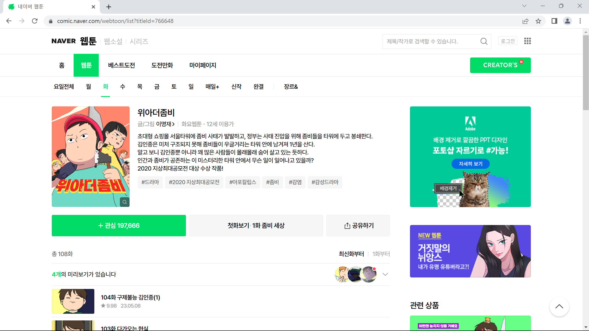

# WebtoonScraper

웹툰을 다운로드하는 프로젝트입니다. 그 외에도 웹툰 모아서 보기 등 몇 가지 편의 기능을 지원합니다.

# 시작하기

1. 파이썬을 PATH를 추가한 뒤 설치합니다.
2. cmd 창을 열어 다음과 같은 명령어를 칩니다.

   ```
   pip install WebtoonScraper
   ```

   또는

   ```
   pip3 install WebtoonScraper
   ```

# 웹툰 다운로드하기

1. 원하는 웹툰으로 가서 titleid를 복사하세요.
   
2. 다음의 파이썬 코드를 웹툰이 다운로드되길 원하는 폴더 내에서 실행해 주세요.

   ```python
   from WebtoonScraper import *

   a = NaverWebtoonScraper()
   a.get_webtoons(76648) # titleid를 여기에다 붙여넣으세요
   ```

   이제 웹툰이 webtoons 폴더에 다운로드됩니다.

   만약 여러 웹툰을 한 번에 다운로드 받고 싶다면 다음과 같이 코드를 짤 수 있습니다.

   ```python
   from WebtoonScraper import *

   webtoon = NaverWebtoonScraper()
   webtoon.get_webtoons(748105, 81482, 728128) # titleid를 여기에다 붙여넣으세요. 길이에 제한은 없습니다.
   ```
3. 만화 뷰어 앱을 통해 다운로드한 웹툰을 시청할 수 있습니다.

## 주의사항

* 중간에 웹툰 다운로드가 멈춘 듯이 보여도 정상입니다. 그대로 가만히 있으면 다운로드가 다시 진행됩니다.
* 만약 작동하지 않는다면 윈도우에서 Python 3.11.3을 설치하고 앞의 과정을 반복해 보세요.

# 여러 회차 하나로 묶기

1. 웹툰을 상기한 대로 다운로드받습니다.
2. 다음과 같이 코드를 짭니다.
   ```python
   from WebtoonScraper import *

   folder = WebtoonFolderManagement('webtoon_merge')
   folder.divide_all_webtoons(5)
   ```
3. webtoons 폴더에 있는 **모든** 웹툰이 'webtoons_merge' 폴더에 5화씩 묶여져 다운로드됩니다.

## 주의사항

* 시작 시 꼭 디렉토리를 선택해 주세요. 아니면 오류가 납니다.
* 작업 중간에 폴더가 사라지고 이미지가 폴더 밖으로 나오는데, 이는 정상 과정입니다.
* 기기 사양에 따라 파이썬이 '응답 없음'을 내보낼 수 있습니다.
* 너무 큰 숫자를 입력하면 웹툰 뷰어가 제대로 작동하지 않을 수 있음을 유의하세요.

# 묶인 회차 다시 원래대로 되돌리기

1. 윗글의 기능으로 묶인 회차를 준비합니다.
2. 다음과 같이 코드를 짭니다.
   ```python
   from WebtoonScraper import *

   folder = WebtoonFolderManagement('webtoon_merge')
   folder.revert_to_original_state('webtoon/1초(725586)')
   ```
3. 'webtoon/1초(725586)' 폴더에 있던 모든 웹툰이 웹툰을 처음 다운로드했던 상태로 되돌아갑니다.

# QNA

## 회차가 띄엄띄엄 있거나 설정된 회차 번호가 작가가 설정한 회차 번호와 다릅니다/회차 묶기를 사용했는데 묶인 회차 수가 설정한 수보다 더 적습니다.

### 생기는 이유

이 프로젝트에서 웹툰의 회차 번호는 ID를 기준으로 합니다. 이는 작가가 정한 회차와는 다를 수 있습니다. 작가가 프롤로그부터 시작하는 경우(프로젝트의 회차 번호가 하나 빠름), 작가가 리메이크를 해서 전에 있던 작품을 제거해서 ID가 연속적으로 있지 않을 경우(주로 베도에서 일어남/회차 번호가 띄엄띄엄하게 있음), 논란이나 작가 실수 등으로 회차가 삭제된 경우(한 회차를 건너띔) 등에서 ID가 불연속적이거나 작품과 일치하기 않는 경우가 생기게 됩니다.
<이미지 넣기>

### ID를 회차 번호로 그대로 사용하는 이유

우선 작가가 설정한 회차 번호에 맞추는 것은 힘듭니다. 우선 번호가 어디에 있을지 알기 어렵고, 프롤로그가 있을지 없을지 알 수 없으며, 여러 화에 걸쳐 같은 에피소드를 진행하는 경우도 있고, 외전으로 본편의 회차에서 분리된 화를 운영하는 경우가 있어 화에 맞추어서 번호를 정하는 것을 어렵습니다.
1부터 시작해서 끝까지 일정한 번호를 유지하는 것도 고려해볼 만하나 만약 그렇게 된다면 무결성 체크를 사용하기 어렵게 됩니다.
따라서 작가가 설정한 회차를 그래로 사용하는 것도 어렵고, 만약 가능하다 할 지라도 무결성 체크를 포기하기 어렵기 때문에 현재는 ID를 회차 번호로 사용하고 있습니다.
