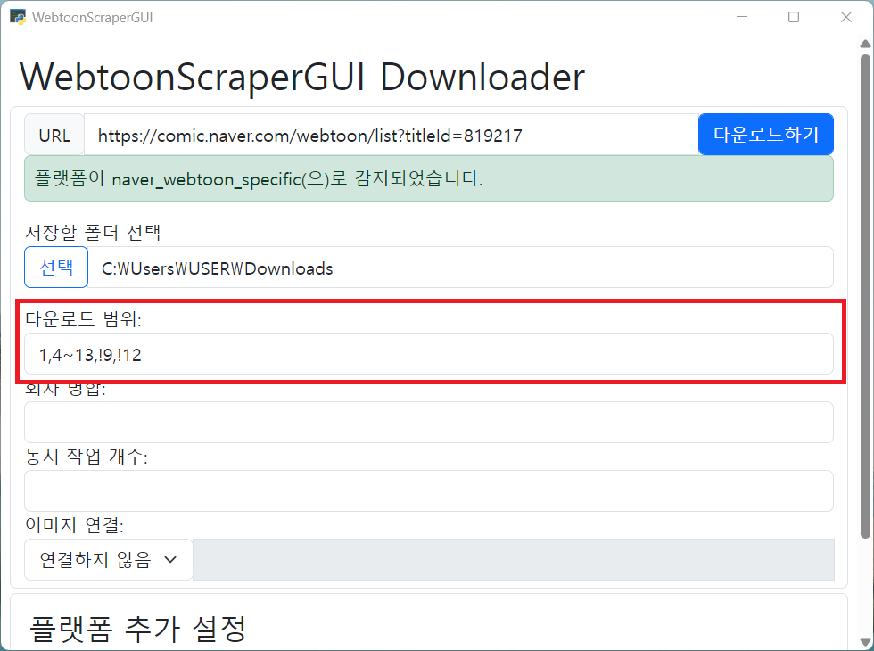

>[!CAUTION]
> **이 문서는 업데이트되지 않으며 과거의 정보를 포함하고 있습니다. [새 문서](https://github.com/ilotoki0804/httpc)에서 업데이트된 내용을 확인하세요.**

# 앱 사용 가이드

실행 파일 사용 방법은 [실행 파일 사용 가이드](./executable-guide.md)를 참고하세요.

>[!NOTE]
> 앱의 외관은 업데이트로 인해 조금씩 변화할 수 있으나, 기능은 동일합니다.

* [앱 사용 가이드](#앱-사용-가이드)
    * [다운로드 및 열기](#다운로드-및-열기)
        * [구매](#구매)
        * [다운로드 및 열기](#다운로드-및-열기-1)
    * [웹툰 다운로드](#웹툰-다운로드)
    * [쿠키](#쿠키)
        * [쿠키 얻기](#쿠키-얻기)
    * [다운로드 범위 지정](#다운로드-범위-지정)
    * [회차 병합](#회차-병합)
    * [이미지 연결](#이미지-연결)
    * [웹툰 감상하기](#웹툰-감상하기)


## 다운로드 및 열기

### 구매

[패트리온](https://www.patreon.com/ilotoki0804)에서 후원할 경우 앱을 다운로드받으실 수 있습니다.
이때 앱을 다운로드받는 방법은 멤버십과 포스트 구매 방법이 있습니다.

멤버십은 기간 중 새 버전이 나왔을 때 바로 다운로드받을 수 있고,
포스트 구매는 일회성이지만 멤버십과 마찬가지로 요구시 일정 기간 지원을 받을 수 있습니다.

### 다운로드 및 열기

멤버십이거나 포스트를 구매하면 앱과 실행 파일이 담겨 있는 포스트를 확인하실 수 있을 겁니다.
여기에서 `windows-app.zip`이라고 되어 있는 파일을 다운로드하세요.


압축 파일을 풀면 아래와 같이 `_internals` 폴더와 `WebtoonScraperGUI.exe`가 보일 텐데
`_internals` 폴더는 작동하는 데에 필요하지만 딱히 직접 건드릴 일은 없습니다.
중요한 것은 `WebtoonScraperGUI.exe`로, 해당 실행 파일을 열어주세요.
이때 "Windows의 PC 보호" 창이 나타난다면 이때 "추가 정보"를 누르고 아래의 "실행" 버튼을 눌러주세요.


아래와 같이 앱이 뜨면 성공입니다! 이제 사용하실 수 있습니다.


## 웹툰 다운로드

가장 기본적으로는 맨 위에 있는 URL 필드에 원하는 웹툰의 링크를 붙여넣으면 됩니다.


이때 플랫폼이 감지되었다는 메시지가 뜬다면 제대로 작동하고 있는 겁니다.

그리고 저장할 폴더를 선택해 주어야 합니다.
웹툰을 다운로드할 디렉토리를 선택해 주세요.


이렇게 하면 다운로드할 준비는 끝났습니다!
URL 옆의 파란색 [다운로드하기] 버튼을 누르기면 됩니다.


다운로드가 끝나면 "모든 작업이 성공적으로 끝났습니다. 창을 닫으셔도 됩니다."라는 메시지가 나옵니다.
이 메시지가 나오면 작업이 종료되었으며 안전하게 나갈 수 있다는 표시입니다.


기본적으로는 여기까지만 알아도 충분하지만, 일부 웹툰은 쿠키라는 추가적인 설정이 필요할 수도 있습니다.

## 쿠키

쿠키는 일종의 웹사이트에서 보여주는 증명서입니다.
이 증명서를 통해 웹사이트는 요청을 보내는 것이 어떤 사용자인지와 같은 정보를 파악할 수 있습니다.

따라서 웹툰을 열람하는 데에 로그인이 필요하다면, 쿠키를 복사해 앱에 붙여넣어 웹툰을 다운로드할 수 있습니다.

쿠키는 맨 아래의 [플랫폼 추가 설정]란에서 입력할 수 있습니다.


모든 플랫폼에서 쿠키가 필요한 것은 아닙니다.
대표적으로 네이버 웹툰의 경우 성인 웹툰이 아니면 다운로드에 쿠키를 필요로 하지 않습니다.

다음은 쿠키가 필요한 플랫폼들만 정리한 표입니다.
여기에 나와 있는 플랫폼들은 특정한 경우에 쿠키를 요구합니다.

| 플랫폼 | 필요 여부 | 비고 |
|--|--|--|
| 네이어 웹툰 | 성인 웹툰의 경우 필요 | |
| 레진코믹스 | 성인 웹툰의 경우 필요 | 특별히 쿠키 외에 bearer가 요구됩니다. [이 내용](platforms.md#bearer)을 참고하세요 |
| 버프툰 | 필요 | |
| 카카오 웹툰 | 성인 웹툰과 대여 및 구매한 웹툰의 경우 필요 | |
| 투믹스 | 필요 | |

### 쿠키 얻기

쿠키를 얻는 방법은 다음과 같습니다.

1. 원하는 **웹툰 플랫폼으로 가서 로그인**하세요.
1. **`f12`를 누르고** `ctrl+R`을 눌러 **새로고침**하세요.
1. `Network` 혹은 `네트워크` 탭으로 가서 제일 **처음에 있는 요청**을 누르세요.
1. 아래로 스크롤에서 `request header` 혹은 `요청 헤더`를 찾은 뒤 그 아래에 **`Cookie:`라고 되어 있는 부분을 찾으세요**.
1. 모든 내용을 복사하세요. 그게 쿠키입니다.

## 다운로드 범위 지정

다운로드 시에는 일부 회차는 다운로드하고 싶지 않을 수 있습니다.
그럴 때에는 다운로드 범위를 지정해 일부 회차를 다운로드에서 제외할 수 있습니다.

그러나 다운로드한 회차를 다시 다운로드받지 않는 것이 주된 목적이라면 굳이 범위를 지정할 필요가 없습니다. WebtoonScraper는 충분히 똑똑해서 이미 다운로드한 회차를 빠르게 스킵할 수 있기 때문입니다.

다운로드 범위 지정에는 기본적으로 자연수를 콤마로 나누어 나열합니다.

```
# 1, 4, 5, 6, 7, 8, 10, 11, 13화를 다운로드
1,4,5,6,7,8,10,11,13
```

물론 모든 회차를 열거할 수는 없으니 `~`를 이용해 해당 범위 내의 회차를 다운로드할 수 있습니다.

```
# 1, 4화부터 8화까지, 10, 11, 13화를 다운로드
1,4~8,10,11,13
```

이때 `~`의 양쪽 끝은 생략할 수 있습니다. 왼쪽을 생략하면 처음부터(1을 쓴 것과 같습니다), 오른쪽을 생략하면 끝까지 다운로드합니다.

```
# 1화부터 15화까지, 20화부터 끝까지 다운로드
~15,20~
```

<details>
<summary>회차 제외에 대한 설명 (고급 기능)</summary>

다운로드하지 않을 회차를 특정하는 방법을 이용할 수도 있습니다.
다운로드하지 않을 회차는 `!`을 앞에 붙여 표현하며, 오른쪽에 있는 값이 더 우선권을 갖습니다.

```
# 1, 4화부터 13화까지 다운로드하되 9화와 12화는 제외
1,4~13,!9,!12
```

원한다면 아예 다운로드하지 않을 회차만 열거할 수도 있습니다.
이때는 `!`으로 범위가 시작해야 합니다.

```
# 3, 12, 16화부터 21화까지를 제외하고 모두 다운로드
!3,!12,!16~21
```

</details>

이렇게 마음에 드는 웹툰 회차 범위를 결정했다면 [다운로드 범위]에 지정한 범위를 적어놓으면 됩니다.



## 회차 병합

회차 병합 기능은 여러 웹툰 회차를 한 디렉토리에 담는 기능입니다.
이 기능을 사용하면 회차가 끝났을 때 다음 회차로 넘어가기 위해 추가적인 동작을 할 필요가 없으며,
특히 한 회차가 짧은 사컷만화 등의 웹툰을 더욱 편하게 볼 수 있습니다.
이 기능은 여러 이미지를 하나로 합치는 기능이 **아니며** 해당 기능은 아래의 [이미지 연결](#이미지-연결)을 참고하세요.

[회차 병합]란에 수를 기입하면 웹툰 다운로드가 끝나는 동시에 회차 병합이 시작합니다.
회차 병합은 단순히 이미지 파일의 이름을 바꾸고 폴더를 옮기는 정도의 일이기 때문에 보통 몇 초 안에 끝납니다.


[마루 뷰어를 사용](#웹툰-감상하기)하는 경우 회차 병합은 5화 정도가 적당합니다.

## 이미지 연결


이미지 병합은 한 회차의 이미지들을 적당한 개수로 묶어 하나의 이미지로 연결하는 기능입니다.

이미지 병합 시에 하나로 묶을 이미지의 개수를 결정하는 데에는 다양한 방식이 있습니다.

| 병합 방식 | 설명 |
| -- | -- |
| 세로 픽셀 수 | 이미지의 전체 세로 픽셀 수가 해당 값 이상이 되도록 설정 |
| 종횡비 | 가로 / 세로의 비. 실수도 가능 |
| 이미지 개수 | 이미지의 개수가 설정한 값이 되도록 설정 |
| 모두 결합 | 한 에피소드의 모든 이미지를 결합 |

[마루 뷰어를 사용](#웹툰-감상하기)하는 경우 세로 픽셀 수가 8000이 되도록 결합하면 로딩 속도가 눈에 띄게 향상됩니다.

## 웹툰 감상하기

이렇게 다운로드받은 웹툰 파일은 웹툰 뷰어를 통해 감상할 수 있습니다.

안드로이드의 경우에는 [마루](https://play.google.com/store/apps/details?id=my.geulga)를 사용하는 것을 추천드립니다.
다만 기본으로 이미지 보기가 페이지 만화를 염두에 두고 기본값이 설정되어 있기 때문에 웹툰을 사용하려면 설정을 조금 수정해야 합니다.

PC의 경우에는 웹툰을 다운로드할 때 기본으로 같이 만들어지는 `webtoon.html` 파일을 이용하면 좋습니다.
`webtoon.html` 파일을 더블클릭하면 웹브라우저에서 해당 웹툰에 대한 웹툰 뷰어가 열립니다.
