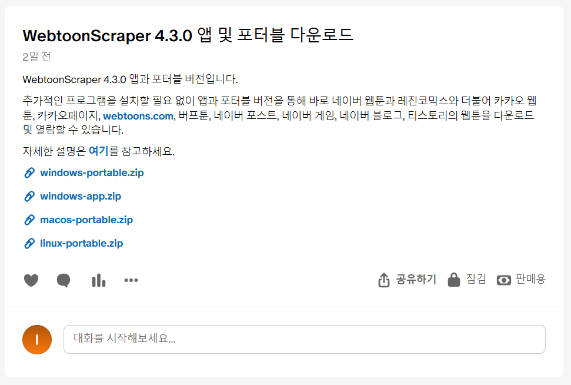

# 실행 파일 사용 방법

실행 파일을 사용하는 방법을 상세하게 설명합니다.
앱 사용 방법은 [앱 사용 가이드](./app-guide.md)를 참고하세요.

* [실행 파일 사용 방법](#실행-파일-사용-방법)
    * [다운로드 및 열기](#다운로드-및-열기)
        * [구매](#구매)
        * [다운로드 및 열기](#다운로드-및-열기-1)
    * [웹툰 다운로드](#웹툰-다운로드)
        * [다운로드할 디렉토리 선택](#다운로드할-디렉토리-선택)
        * [cookie](#cookie)
        * [다운로드하고 싶은 범위 설정](#다운로드하고-싶은-범위-설정)
        * [에피소드 확인](#에피소드-확인)
        * [플랫폼 종속적 옵션](#플랫폼-종속적-옵션)
        * [여러 웹툰 다운로드](#여러-웹툰-다운로드)
        * [다운로드 중단 시 작동](#다운로드-중단-시-작동)
    * [웹툰 에피소드 병합하기](#웹툰-에피소드-병합하기)
    * [웹툰 이미지 결합하기](#웹툰-이미지-결합하기)
        * [이미지 결합 옵션](#이미지-결합-옵션)
        * [스레드 개수 정하기](#스레드-개수-정하기)
    * [스냅샷](#스냅샷)
        * [압축 파일의 스냅샷](#압축-파일의-스냅샷)
        * [재스냅](#재스냅)
    * [웹툰 감상하기](#웹툰-감상하기)


## 다운로드 및 열기

### 구매

[패트리온](https://www.patreon.com/ilotoki0804)에서 후원할 경우 앱을 다운로드받으실 수 있습니다.
이때 앱을 다운로드받는 방법은 멤버십과 포스트 구매 방법이 있습니다.

멤버십은 기간 중 새 버전이 나왔을 때 바로 다운로드받을 수 있고,
포스트 구매는 일회성이지만 멤버십과 마찬가지로 요구시 일정 기간 지원을 받을 수 있습니다.

### 다운로드 및 열기

멤버십이거나 포스트를 구매하면 앱과 실행 파일이 담겨 있는 포스트를 확인하실 수 있을 겁니다.
여기에서 `(사용하는 운영체제 이름)-portable.zip`이라고 되어 있는 파일을 다운로드하세요.



압축 파일을 풀면 아래와 같이 `_internals` 폴더와 `pyinstaller.exe`(혹은 그냥 `pyinstaller`)가 보일 텐데
`_internals` 폴더는 작동하는 데에 필요하지만 딱히 직접 건드릴 일은 없습니다.
중요한 것은 `pyinstaller`로, 해당 실행 파일을 열어주세요.


단, 운영 체제별로 참고해야 할 사항이 있습니다.

* 윈도우: "Windows의 PC 보호" 창이 뜨면서 실행이 안 될 수 있습니다. 그런 경우에는 `추가 정보`(왼쪽 중간에 있습니다.)를 클릭하고 `실행`을 누르세요.
* 맥OS와 리눅스: `bash: ./pyinstaller: Permission denied`라고 나오며 실행을 거부할 수 있습니다. `chmod +x ./pyinstaller`를 통해 실행 권한을 추가하세요.

아래와 같이 터미널이 뜨면 성공입니다! 이제 사용하실 수 있습니다.


## 웹툰 다운로드

가장 기본적으로는 다음과 같이 웹툰의 소개 페이지의 URL을 복사한 후 `webtoon download` 뒤에 큰따옴표를 친 URL을 놓으면 사용하실 수 있습니다.

```console
webtoon download "https://comic.naver.com/webtoon/list?titleId=819217"
```

이렇게 하면 `webtoon` 폴더 안에 웹툰 디렉토리가 생성되고, 해당 URL에 있는 웹툰이 다운로드됩니다.

### 다운로드할 디렉토리 선택

용어를 잘 구분해 봅시다. WebtoonScraper에는 `웹툰 디렉토리`와 `베이스 웹툰 디렉토리`가 있습니다.
`웹툰 디렉토리`는 웹툰 에피소드, 썸네일, 정보 파일 등이 다운로드되는 디렉토리입니다.
이 디렉토리의 경우에는 별도로 이름을 설정할 수 있는 기능은 없으며,
웹툰을 다운로드할 때 `<웹툰 제목>(<웹툰 ID>, <추가적 파일 상태 설명>)`의 형식으로 설정되어 만들어집니다.

`베이스 웹툰 디렉토리` 혹은 `웹툰 디렉토리 컨테이너`는 `웹툰 디렉토리`가 위치할 디렉토리를 의미합니다.
예를 들어 `베이스 웹툰 디렉토리` 값이 `hello`이고 웹툰 ID가 `1234`인 `가나다웹툰`이라는 웹툰을 다운로드받는다면 `hello/가나다웹툰(1234)/`가 웹툰 디렉토리의 경로가 됩니다.
`베이스 웹툰 디렉토리`의 기본값은 현재 디렉토리이지만, 필요하다면 `-d` 플래그로 변경할 수 있습니다.

```console
webtoon download "https://comic.naver.com/webtoon/list?titleId=819217" -d "where/webtoon/directory/stored/"
```

파이썬으로 사용할 때에는 `.base_directory` 속성을 변경해 `베이스 웹툰 디렉토리`를 수정할 수 있습니다.

```python
from WebtoonScraper.scrapers import NaverWebtoonScraper
from pathlib import Path

scraper = NaverWebtoonScraper.from_url("https://comic.naver.com/webtoon/list?titleId=819217")
scraper.base_directory = Path("path/to/store/webtoon/directory")
scraper.download_webtoon()
```

### cookie

쿠키는 웹에서 여러 가지 정보를 저장하는데, 웹에서 로그인한 사람이 누구인지 확인하는 데에 사용되기도 합니다.

WebtoonScraper는 로그인된 웹사이트에서 쿠키를 가져와 로그인이 필요한 웹툰 플랫폼들에서 로그인 정보를 쿠키를 통해 제공하고 웹툰을 다운로드합니다.

쿠키를 얻는 방법은 다음과 같습니다.

1. 원하는 웹툰 플랫폼으로 가서 로그인하세요.
1. `f12`를 누르고 `ctrl+R`을 눌러 새로고침하세요.
1. `Network` 혹은 `네트워크` 탭으로 가서 제일 처음에 있는 아이템을 누르세요.
1. 아래로 스크롤에서 `request header` 혹은 `요청 헤더`를 찾은 뒤 그 아래에 `Cookie:`라고 되어 있는 부분을 찾으세요.
1. 모든 내용을 복사하세요. 그게 쿠키입니다.

만약 CLI에서 사용하는 경우에는 다음과 같이 명령어를 구성할 수 있습니다.

```console
webtoon download ... --cookie "<쿠키 전체>"
```

즉, 원래 명령어를 놓고, `--cookie`를 추가한 뒤 뒤에 큰따옴표로 감싼 쿠키 전체를 그대로 붙여넣어 주시면 됩니다. *큰따옴표 까먹지 마세요!*

`<쿠키 전체>`의 자리에 쿠키를 그대로 붙여넣으면 됩니다.

대표적으로 다음의 웹툰 플랫폼들은 쿠키를 요구합니다.

| 플랫폼 이름 | 비고 |
|--|--|
| 네이버 웹툰 | 성인 웹툰에 한해 필요 |
| 레진코믹스 | 성인 웹툰에 한해 필요 |
| 버프툰 | 유효 기간이 짧아 지속적으로 로그인이 필요 |
| 카카오 웹툰 | 필수가 아님 |

쿠키는 고정되어 있지 않습니다. 일부 웹사이트들은 특정한 기간을 두고 쿠키를 만료시켜 다시 로그인하도록 합니다.
버프툰이 대표적인 예입니다. 그러한 웹툰 플랫폼의 경우, 그럴 때마다 쿠키를 위의 방법으로 다시 가져와야 합니다.

### 다운로드하고 싶은 범위 설정

웹툰을 다운로드할 때 범위를 설정해 다운로드할 수 있습니다.

가장 기본적으로는 다운로드하고 싶은 회차들을 단순히 나열할 수 있습니다.
이때 `-r 1,2,...`를 사용합니다.

```console
echo 20, 12, 25, 26화 다운로드
webtoon download (생략) -r 20,12,25,26
```

이렇게 하는 데에는 한계가 있으니 `시작~끝`을 통해 범위를 설정하여 다운로드할 수 있습니다.

```console
echo 13화부터 24화까지 다운로드
webtoon download (생략) -r 13~24
```

이때 양쪽 끝은 생략할 수 있는데, `시작~끝`에서 `시작`을 생략하면 처음부터, `끝`을 생략하면 끝까지 다운로드됩니다.

```console
echo 1화부터 38화까지 다운로드
webtoon download (생략) -r ~38

echo 27화부터 끝까지 다운로드
webtoon download (생략) -r 27~
```

이때 모든 범위를 `,`로 구분하여 섞어 나타낼 수도 있습니다.

```console
webtoon download (생략) -r ~5,7,15,23~47,53,67~
```

`!`를 앞에 두면 특정 범위를 제외할 수 있습니다.

```console
echo 10화부터 끝까지 다운로드하나 35화를 제외함
webtoon download (생략) -r 10~,!35
```

이때 "회차"는 실제 회차와는 크게 관련이 없고, 맨 처음 에피소드를 1로 하여 순서대로 붙은 순서를 나타냅니다.
예를 들어 실제 웹툰은 프롤로그, 특별편, QnA 등으로 에피소드는 있지만 회차 번호는 증가하지 않을 수 있지만,
이때 이 "회차"는 항상 증가합니다.
정확한 회차 번호를 확인하려면 [`--list-episodes` 옵션](#에피소드-확인)을 사용해 보세요.

파이썬 스크립트에서는 `EpisodeRange`의 객체를 `.download_webtoon()` 메서드의 `episode_no_range`에 제공하면 됩니다.
자세한 설명은 `EpisodeRange`의 docstring을 참고하세요. 아래는 예시입니다.

```python
from WebtoonScraper.scrapers import NaverWebtoonScraper, EpisodeRange
from pathlib import Path

# CLI에서 사용하는 방식 그대로 에피소드 범위를 생성하려면 `.from_string()` 메서드를 사용하세요.
episode_range = EpisodeRange.from_string("~5,7,15,23~47,53,67~")
# 파이썬 객체로는 slice, range, int 등이 사용 가능하며,
# slice나 range를 사용하면 메모리 효율적입니다.
# 아래 예시는 위의 `.from_string`과 정확하게 같은 동작을 하는 코드입니다.
episode_range = EpisodeRange(slice(None, 6), 7, 15, range(23, 48), 53, slice(67, None))

scraper = NaverWebtoonScraper.from_url("https://comic.naver.com/webtoon/list?titleId=819217")
scraper.download_webtoon(
    episode_no_range=episode_range
)
```

### 에피소드 확인

`--list-episodes` 옵션을 활용하면 전체 에피소드 목록과 각 에피소드의 회차 번호와 에피소드 제목을 출력하고 종료됩니다.
예를 들어 다음과 같이 실행할 수 있습니다.

```console
webtoon download "<url>" --list-episodes
```

이때 실제로 다운로드가 진행되지는 않으며, 회차를 열거하는 것과 관련 없는 옵션들은 모두 무시됩니다.

### 플랫폼 종속적 옵션

일부 플랫폼은 자신만의 설정을 가지고 있을 수 있습니다.
예를 들어 추가적인 인증 수단이나 댓글 다운로드와 같은 기능이 있을 수도 있습니다.

플렛폼 종속적 옵션은 `--option` 플래그를 이용해서 사용하실 수 있습니다.

지정할 때는 `--option OPT1=VAL1 OPT2=VAL2`와 같이 작성합니다.

예를 들어 다음과 같습니다.

```console
webtoon download ... --option bearer="Bearer ..." get_paid_episode=true
```

이때 옵션과 값 사이에는 등호가 위치하는데, **옵션명과 값이 띄어져 있어서는 안 됩니다**.

또한 옵션이 복잡한 경우 큰따옴표를 이용할 수 있습니다.

### 여러 웹툰 다운로드

여러 웹툰을 다운로드하려면 다운로드받고 싶은 웹툰의 URL을 열거하면 됩니다.

```console
webtoon download "https://comic.naver.com/webtoon/list?titleId=819217" "https://comic.naver.com/webtoon/list?titleId=670145"
```

이때 설정이 공유되며 WebtoonScraper를 따로 로드할 필요가 없어 각각 따로 명령어를 실행하는 것에 비해 빠릅니다.

### 다운로드 중단 시 작동

웹툰을 다운로드하다가 모종의 이유로 다운로드가 중단될 수 있습니다.
그럴 경우 WebtoonScraper는 자동으로 뒷정리를 하게 됩니다.
또한 웹툰을 다시 다운로드받을 때에서 처음부터 다시 다운로드하는 게 아닌 다운로드되지 않은 부분만 자동으로 다운로드받습니다.

## 웹툰 에피소드 병합하기

한 웹툰은 여러 에피소드로 이루어져 있습니다. 에피소드 병합 기능은 몇 개의 에피소드가 한 개의 디렉토리로 모이도록 하는 기능입니다.

이 기능은 한 에피소드가 끝난 후 이동하는 것이 까다롭거나 귀찮은 경우 사용할 수 있습니다.

몇 개의 에피소드를 한 디렉토리로 묶을 것인지를 값으로 제공해야 합니다.

맨 마지막 에피소드가 개수가 설정된 값보다 작을 경우 한 개의 디렉토리에 모아놓게 됩니다. 예를 들어 전체 에피소드가 13개이고 5개씩 묶도록 설정했을 경우 1~5/6~18로 마지막 디렉토리의 개수가 5보다 작아지지 않도록 나뉘어지게 됩니다.

에피소드 병합은 두 가지 방식으로 진행할 수 있습니다.

* 웹툰 다운로드 시에 `-m` 옵션을 제공
* `webtoon merge` 명령어를 사용

첫 번째 방식은 `webtoon download` 명령어 뒤에 `-m` 옵션을 더하면 됩니다.

```console
webtoon download "https://comic.naver.com/webtoon/list?titleId=819217" -m 5
```

이렇게 하면 다운로드 후 자동으로 설정한 기준에 따라 병합합니다.

두 번째 방식은 `webtoon merge <디렉토리> -m <병합 기준 수>`로 적으면 됩니다.

```console
webtoon merge "webtoon/웹툰 이름(12345)" -m 5
```

이 방식 대신 `-s` 옵션을 붙여 디렉토리 선택기로 가도록 할 수도 있습니다. 이때 경로는 베이스 디렉토리를 명시하면 됩니다.

```console
webtoon merge "webtoon" -s -m 5
```

이렇게 하면 웹툰 디렉토리 이름을 알지 않고도 직접 보고 선택해 에피소드를 병합할 수 있습니다.

## 웹툰 이미지 결합하기

한 에피소드는 여러 개의 이미지로 구성됩니다. 이미지 결합 기능은 몇 개의 이미지를 기준에 따라 한 개의 이미지로 병합하는 기능입니다.
이 기능은 시간이 많이 걸리며 컴퓨팅 파워를 많이 사용합니다. 따라서 기기가 버벅일 수 있고 인내심을 가지고 조금 기다려야 합니다.

이미지 결합 기능을 사용하려면 `WebtoonScraper[concat]` 추가 의존성이 필요합니다. `WebtoonScraper[full]`로 WebtoonScraper를 잘 설치했다면 딱히 추가적인 행동이 필요하지는 않습니다.

### 이미지 결합 옵션

웹툰 이미지 결합은 다음과 같은 조건들을 기준으로 결정됩니다.

| 이름 | 같이 오는 값 | 설명 | 예시 |
|--|--|--|--|
| all | 없음 | 에피소드 내 모든 이미지를 결합합니다. | `all`은 한 에피소드 내에 있는 모든 이미지를 결합합니다. |
| count | 자연수 | 에피소드 내 이미지를 개수에 따라 결합합니다. | `count 5`는 이미지 5개를 하나의 파일로 잇습니다. |
| height | 자연수 | 이미지의 세로 픽셀 개수가 최소 해당 값 이상이 되도록 결합합니다. | `height 8000`은 이미지들의 가로 픽셀이 합쳐졌을 때 최소 8000픽셀이 되도록 결합합니다. |
| ratio | 실수 | 이미지의 가로 픽셀 수에 대한 세로 픽셀 수 비율이 해당 값 이상이 되도록 결합합니다. | `ratio 12.5`는 이미지의 `세로 픽셀 수 / 가로 픽셀 수`의 비율이 `12.5` 이상이 되도록 합니다. |

모든 경우 마지막 파일은 해당 조건을 충족하지 못할 수 있습니다. 예를 들어 전체 파일 개수가 12개일 때 `count 5`라면 맨 마지막 파일은 2개가 결합된 파일일 수 있습니다.

웹툰 이미지 결합은 두 가지 방식으로 진행할 수 있습니다.

* 웹툰 다운로드 시에 `--concat` 옵션을 제공
* `webtoon concat` 명령어를 사용

첫 번째 방식은 `webtoon download` 명령어 뒤에 `concat` 옵션을 더하면 됩니다.

```console
webtoon download "https://comic.naver.com/webtoon/list?titleId=819217" --concat all
webtoon download "https://comic.naver.com/webtoon/list?titleId=819217" --concat count 5
webtoon download "https://comic.naver.com/webtoon/list?titleId=819217" --concat height 8000
webtoon download "https://comic.naver.com/webtoon/list?titleId=819217" --concat ratio 12.5
```

이렇게 하면 다운로드 후 자동으로 설정한 기준에 따라 결합합니다.

두 번째 방식은 `webtoon concat <디렉토리>`로 적은 후 필요한 옵션을 적으면 됩니다.

```console
webtoon concat "webtoon/웹툰 이름(12345)" --all
webtoon concat "webtoon/웹툰 이름(12345)" --count 5
webtoon concat "webtoon/웹툰 이름(12345)" --height 8000
webtoon concat "webtoon/웹툰 이름(12345)" --ratio 12.5
```

이 방식 대신 `-s` 옵션을 붙여 디렉토리 선택기로 가도록 할 수도 있습니다.

```console
webtoon concat "webtoon" -s --all
webtoon concat "webtoon" -s --count 5
webtoon concat "webtoon" -s --height 8000
webtoon concat "webtoon" -s --ratio 12.5
```

이렇게 하면 웹툰 디렉토리 이름을 알지 않고도 직접 보고 선택해 웹툰을 결합할 수 있습니다.

### 스레드 개수 정하기

결합 시에는 멀티스레딩이 활용됩니다. 이때 프로세스의 기본 개수는 전체 스레드 개수의 반이며, `--thread-number` 옵션으로 프로세스 개수를 조절할 수 있습니다.

예를 들어 프로세스 6개를 사용하도록 변경한다면 다음과 같이 설정할 수 있습니다.

이 옵션은 `webtoon`과 `concat` 사이에 들어가야 합니다. 위치에 주의하세요!

```console
webtoon --thread-number 6 concat ...
```

이때 `--thread-number`를 1로 설정하면 멀티스레딩을 사용하지 않습니다.

## 스냅샷

웹툰을 저장하는 위치와 웹툰을 다운로드하는 위치가 다른 경우 웹툰의 다운로드 상태를 통해 다운로드를 관리하기 어려울 수 있습니다. 그럴 경우 스냅샷을 이용해 웹툰 디렉토리의 상태를 보존할 수 있습니다.

웹툰 디렉토리 이름이 `웹툰(1234)`일 경우 해당 디렉토리에 대해 스냅샷을 설정하려면 다음의 명령어를 사용할 수 있습니다.

```console
webtoon snap "웹툰(1234)"
```

해당 명령어를 실행하면 웹툰 디렉토리의 바로 옆에 `웹툰(1234).snapshots`라는 이름의 파일이 생성될 겁니다.
이를 스냅샷 파일이라고 하며, 이 스냅샷 파일이 있는 경우 `웹툰(1234)` 디렉토리를 다른 곳으로 이동하더라도 WebtoonScraper는 마치 해당 디렉토리가 여전히 존재하는 것처럼 에피소드를 스킵하는 등의 기능을 그대로 수행합니다.

여타 다른 기능들과 마찬가지로 디렉토리 선택을 통해 접근할 수도 있습니다.

```console
webtoon snap . -s
```

### 압축 파일의 스냅샷

또한 압축 파일에 대해서도 스냅샷을 생성할 수도 있습니다. 이때는 명령어에 `--zip`을 붙여야 합니다.

```console
webtoon snap "웹툰(1234).zip" --zip
webtoon snap . -s --zip
```

다만 이 경우 `웹툰(1234)`가 *아닌* `웹툰(1234).zip`에 대한 스냅샷이 생성되기에 파일명이 `웹툰(1234).zip.snapshots`인 점에 주의하새요.
이때 중간에 있는 `.zip`을 제거하면 원래 웹툰 디렉토리에 대한 스냅샷 파일처럼 사용할 수 있습니다.

>[!WARNING]
> `.zip`이 아닌 압축 포맷(7z, tgz, tar, 등)은 지원되지 않습니다.

### 재스냅

한번 스냅샷이 생성된 경우에도 동일한 명령어(`webtoon snap ...`)를 통해 스냅샷을 업데이트할 수 있습니다.
이렇게 하면 현재 폴더 내부에 있는 파일의 정보가 스냅샷에 더해집니다.

>[!WARNING]
> 스냅샷에는 정보가 쓰여지지만 제거되지는 않습니다. 이런 누적적인 특성 때문에 스냅샷을 과도하게 사용해서는 안 되며, 파일이 이동하는 등 불가피한 상황에서는 재스냅을 해야 합니다.

## 웹툰 감상하기

이렇게 다운로드받은 웹툰 파일은 웹툰 뷰어를 통해 감상할 수 있습니다.

안드로이드의 경우에는 [마루](https://play.google.com/store/apps/details?id=my.geulga)를 사용하는 것을 추천드립니다.
다만 기본으로 이미지 보기가 페이지 만화를 염두에 두고 기본값이 설정되어 있기 때문에 웹툰을 사용하려면 설정을 조금 수정해야 합니다.

PC의 경우에는 웹툰을 다운로드할 때 기본으로 같이 만들어지는 `webtoon.html` 파일을 이용하면 좋습니다.
`webtoon.html` 파일을 더블클릭하면 웹브라우저에서 해당 웹툰에 대한 웹툰 뷰어가 열립니다.
