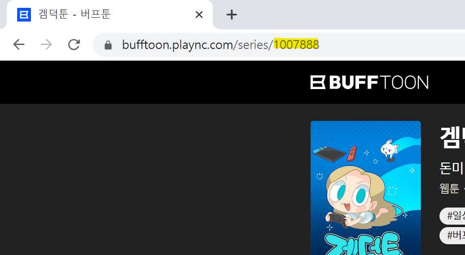
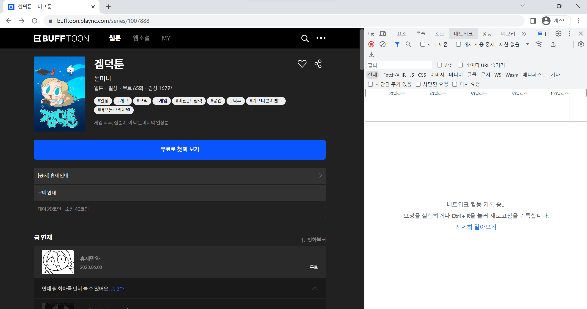
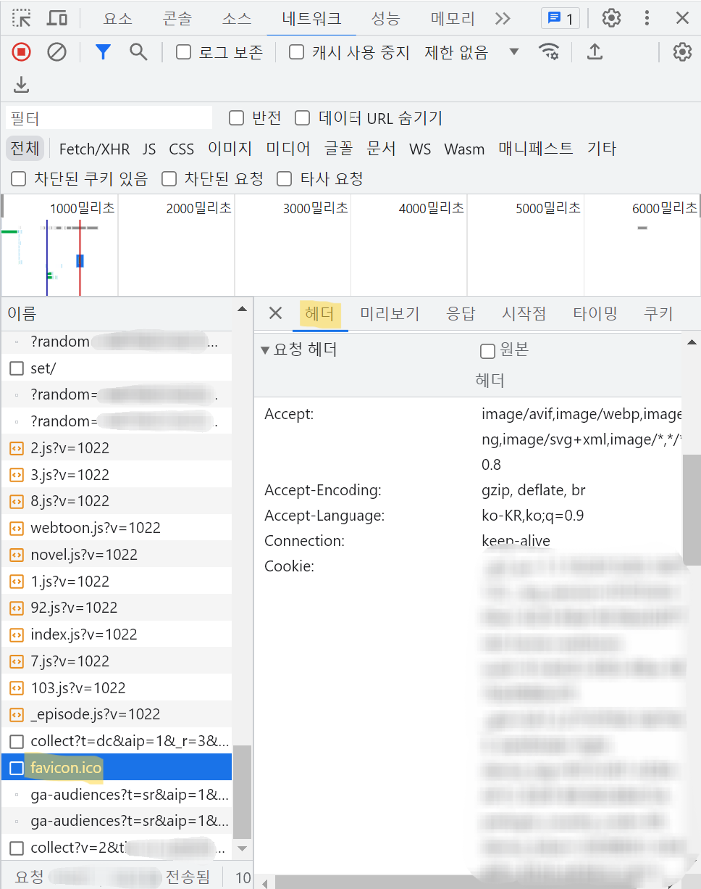
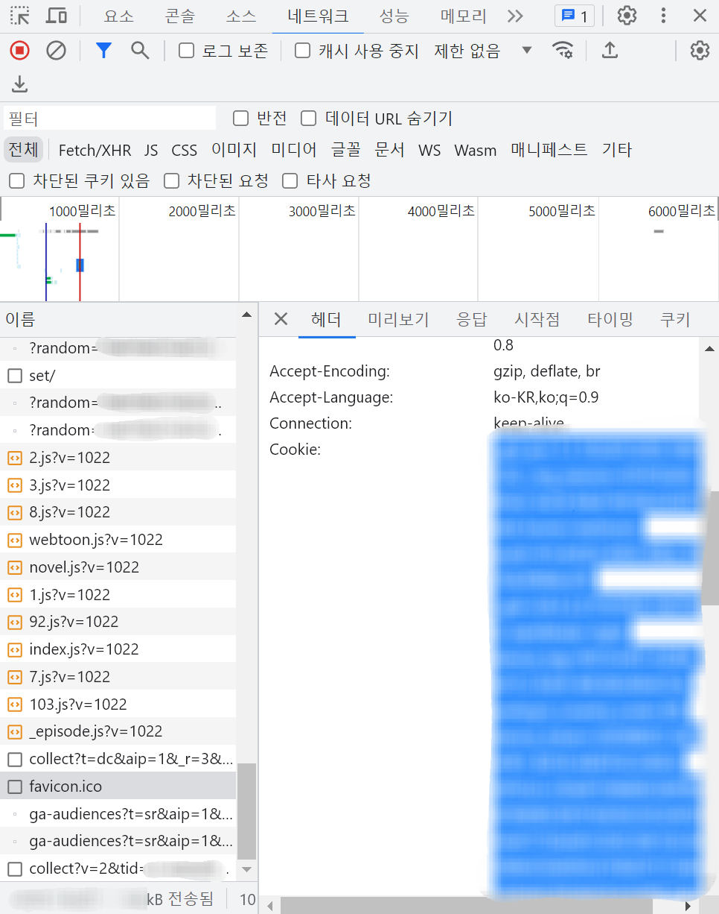
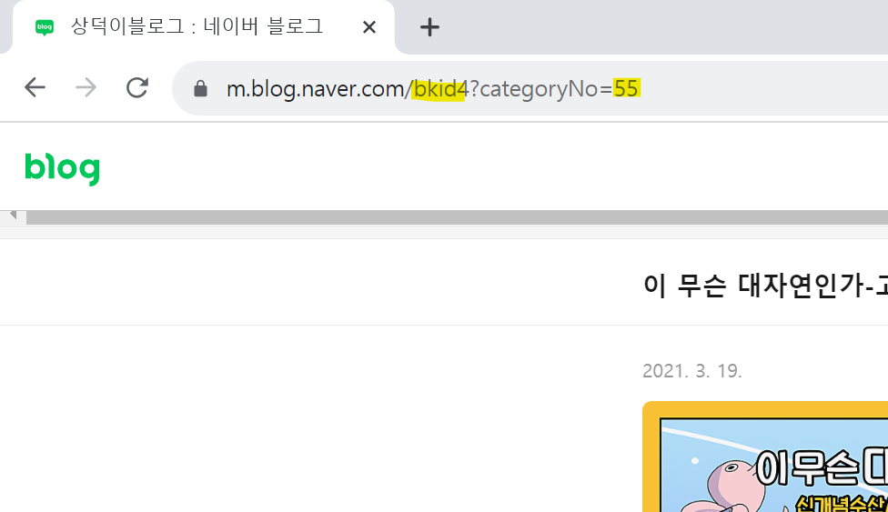

# 사용 방법

시작하기 전에 [설치](../README.md#Installation)는 제대로 되었는지 확인하세요.

WebtoonScraper는 CLI로도, 파이썬으로도 사용할 수 있습니다. 만약 자신이 간단한 사용을 원하는 것이라면 CLI를, 고급 기능을 사용하고 싶다면 파이썬을 사용하는 것을 추천합니다.

간단하게 각 플랫폼별 다운로드 예시를 알고 싶다면 아래의 [플랫폼별 다운로드 방법 및 예시](how_to_use.md#플랫폼별-다운로드-방법-및-예시) 항목을 참고하세요.

## 웹툰 플랫폼

웹툰 플랫폼은 다시 말해 웹툰 제공처입니다. 네이버 웹툰, 레진코믹스같이 웹툰 플랫폼으로 나온 플랫폼이 있는가 하면 네이버 블로그나 티스토리처럼 웹툰만은 위한 플랫폼은 아니지만 일부 사용자들이 웹툰도 올리는 식으로 사용되는 플랫폼들도 있습니다.

단순하게 웹툰 ID만 알면 다운로드 가능한 형태의 플랫폼도 있고, 로그인같은 특별한 방식을 사용해야 하는 경우도 있습니다.

하지만 반대로 이야기하면 이 플랫폼들은 로그인이 필요한 유료 회차나 3다무, 매일+ 다운로드 등을 지원하지 않는다는 이야기이기도 합니다. 이는 지원이 실질적으로 불가능한 경우도 있고, 단순히 아직까지 제작이 시도되지 않아서일수도 있습니다.

네이버의 경우 가장 단순한 자연수 기반의 웹툰 ID를 사용하지만 모든 웹툰 플랫폼이 그렇지는 않습니다. 아래에는 웹툰 플랫폼별로 사용하는 타입이 정리되어 있습니다. `추가 인증 요구 여부`와 `플랫폼 코드`는 후술합니다.

| 플랫폼 이름 | 플랫폼 코드 | 플랫폼 코드 축약형 | 스크래퍼 이름 | 웹툰 ID로 사용되는 타입 | 예시 | 추가 인증 요구 여부 |
|--|--|--|--|--|--|--|
| 네이버 웹툰   | `'naver_webtoon'`   | `nw` | NaverWebtoonScraper    | int | `809590` | 아니오 |
| webtoons.com | `'webtoons_dotcom'` | `wd` | WebtoonsDotcomScraper | int | `5291` | 아니오 |
| 버프툰        | `'bufftoon'`        | `bt` | BufftoonScraper        | int | `1001216` | 예 |
| 네이버 포스트 | `'naver_post'`      | `np` | NaverPostScraper       | tuple[int, int] | `(597061, 19803452)` | 아니오 |
| 네이버 게임   | `'naver_game'`      | `ng` | NaverGameScraper       | int | `5` | 아니오 |
| 레진코믹스    | `'lezhin_comics'`   | `lc` | LezhinComicsScraper    | str | `"dr_hearthstone"` | 예 |
| 카카오페이지  | `'kakaopage'`       | `kp` | KakaopageScraper       | int | `53397318` | 아니오 |
| 네이버 블로그 | `'naver_blog'`      | `nb` | NaverBlogScraper       | tuple[str, int] | `("bkid4", 55)` | 아니오 |
| 티스토리     | `'tistory'`          | `ti` | TistoryScraper         | tuple[str, str] | `("doldistudio", "진돌만화")` | 아니오 |
| 카카오 웹툰   | `'kakao_webtoon'`   | `kw` | KakaoWebtoonScraper    | int | `1180` | 아니오 |

## CLI 사용 방법

WebtoonScraper를 다운로드하면 `webtoon` 명령어를 사용할 수 있습니다.

```console
c:\Users>webtoon -h
usage: Download or merge webtoons in CLI

Download webtoons with ease!
...
```

만약 해당 명령어가 작동하지 않을 경우 `python -m WebtoonScraper` 명령어를 사용하세요.

```console
c:\Users>python -m WebtoonScraper -h
usage: Download or merge webtoons in CLI

Download webtoons with ease!
...
```

이 뒤부터는 `webtoon` 명령어를 사용합니다. 만약 오류가 난다면 모든 `webtoon`를 `python -m WebtoonScraper`로 바꿔서 진행하세요. 그래도 오류가 반복된다면 path를 포함한 파이썬 설치가 제대로 되었는지, 패키지 설치가 제대로 되었는지, 가상 환경 내에서만 설치된 것은 아닌지 확인하세요.

### `download` 커맨드

웹툰을 다운로드하려면 플랫폼에 따라 2~3 가지가 필요합니다.

* 웹툰 플랫폼
* 웹툰 ID
* 일부 로그인이 필요한 플랫폼이 경우 cookie와 bearer를 필요로 할 수 있습니다.

각각에 대해서는 각자의 플랫폼에 대해서는 [아래](how_to_use.md#플랫폼별-다운로드-방법-및-예시)에서 각자 안내됩니다.

#### -m merge_number, --merge-number merge_number 옵션

WebtoonScraper는 웹툰 모아서 보기를 지원합니다. 만약 이 파라미터가 설정되어 있다면 웹툰을 다운로드 한 뒤 웹툰 모아서 보기가 설정됩니다.

```console
echo 5화씩 모아서 보기
webtoon download 809590 -p naver_webtoon -m 5
```

#### --cookie cookie, --bearer bearer 옵션

일부 플랫폼은 다운로드를 위해 로그인을 필요로 하기도 합니다. 이럴 경우 적절한 값을 웹 브라우저에서 찾아서 보내야 합니다. 각각의 플랫폼 다운로드에서 더욱 자세히 설명합니다.

#### -r [start]~[end], --range [start]~[end] 옵션

웹툰을 다운로드받을 때 다운로드받을 범위를 구합니다. 이때 end에 해당하는 값을 포함하여 다운로드됩니다. 각각의 값은 생략될 수 있는데, start가 생략된다면 1화가 되고 end가 생략된다면 끝 화가 됩니다.

```console
echo 2화부터 4화까지 다운로드
webtoon download 809590 -p naver_webtoon -r 2~4

echo 2화부터 끝까지(예: 5화)까지 다운로드
webtoon download 809590 -p naver_webtoon -r 2~

echo 처음(1화)부터 3화까지 다운로드
webtoon download 809590 -p naver_webtoon -r ~3
```

만약 한 화만 다운로드받고 싶다면 다음과 같이 그냥 수만 적어 주면 됩니다.

```
echo 3화만 다운로드
webtoon download 809590 -p naver_webtoon -r 3
```

고급 기능(예: 짝수 회차만 다운로드받는 등)을 사용하려면 파이썬 기능을 활용해야 합니다.

#### -d directory, --download-directory directory 옵션

"웹툰 디렉토리"의 위치를 의미합니다. 기본값은 `webtoon`으로, 만약 기본값으로 다운로드한다면 `webtoon/웹툰 제목(웹툰 ID)` 안에 다운로드됩니다.

만약 현재 디렉토리에 다운로드하고 싶다면 값을 `.`으로 설정하세요.

```console
echo 'webtoon/웹툰 제목(웹툰 ID)'에 다운로드 (기본값)
webtoon download 809590 -p naver_webtoon

echo 'files/my-webtoons/웹툰 제목(웹툰 ID)'에 다운로드
webtoon download 809590 -p naver_webtoon -d "files/my-webtoons"

echo 'C:\Users'에 다운로드
webtoon download 809590 -p naver_webtoon -d "C:\Users"

echo 현재 폴더에 다운로드
webtoon download 809590 -p naver_webtoon -d .

echo 상위 폴더에 다운로드
webtoon download 809590 -p naver_webtoon -d ..
```

#### --list-episodes 옵션

전체 에피소드를 보여주는 옵션입니다. 다운로드를 하지는 않습니다.

```console
C:\Users>webtoon download 809590 -p naver_webtoon --list-episodes
 Episode
 number (ID)   Episode Title
 0001 (1)      1화
 0002 (2)      2화
 0003 (3)      3화
 0004 (4)      4화
 0005 (5)      5화
```

#### --get-paid-episode 옵션

레진코믹스에서 유료 회차를 다운로드받는 옵션입니다. 이때 다량의 경고가 나타날 수 있는데, 정상 과정이니 신경쓰지 않으셔도 됩니다.

### `merge` 커맨드

merge 커맨드는 웹툰 모아서 보기를 지원하기 위한 기능입니다.

다음과 같은 커맨드는 `webtoon` 디렉토리에 있는 웹툰 디렉토리들이 모두 리스팅되고 그중에서 번호를 선택해 고르면 merge가 진행됩니다.

```console
webtoon merge webtoon
```

선택된 웹툰이 일반 웹툰 디렉토리라면 묶어지고, 이미 묶인 디렉토리라면 원래 상태로 복구됩니다.

이 과정에서 `webtoon.html`이 다시 제작됩니다.

## 실행 파일 다운로드

실행 파일로 사용 시에는 CLI와 같은 명령어를 사용합니다.

[설치 가이드](../README.md#실행-파일로-이용하기베타)에 설명된 방식으로 설치 후 실행한 뒤 `CLI 사용 방법` 가이드에 나와 있는 데로 사용하면 됩니다.

```console
usage: Download or merge webtoons in CLI

Download webtoons with ease!

...

Welcome to WebtoonScraper shell!
Type 'exit' to quit
>>> (여기에 CLI 명령어를 입력하세요)
```

## 파이썬으로 다운로드

파이썬으로 접근해 더욱 다양한 이 패키지의 기능들을 사용하고 싶다면 `WebtoonScraper.scrapers`에 있는 여러 스크래퍼 클래스를 사용할 수 있습니다.

우선 스크래퍼를 다운로드하려면 `WebtoonScraper.scrapers`에서 자신이 원하는 스크래퍼를 import하면 됩니다.

```python
from WebtoonScraper.scrapers import NaverWebtoonScraper
```

그다음, 다음과 같은 코드를 통해 웹툰을 다운로드할 수 있습니다.

```python
from WebtoonScraper.scrapers import NaverWebtoonScraper

scraper = NaverWebtoonScraper(809590)
scraper.download_webtoon()
```

모든 스크래퍼에서 사용할 수 있는 기능이나 특징은 다음과 같습니다.

### import

모든 스크래퍼는 `WebtoonScraper.scrapers` 안에 있습니다.

```python
from WebtoonScraper.scrapers import NaverWebtoonScraper
```

스크래퍼 이름은 위의 표에 나와 있습니다.

### 초기화

스크래퍼들은 기본적으로 웹툰 ID를 첫 번째 인자로 받습니다.

```python
from WebtoonScraper.scrapers import NaverWebtoonScraper

# 예시 웹툰 URL: https://comic.naver.com/webtoon/list?titleId=819217
scraper = NaverWebtoonScraper(819217)
scraper.download_webtoon()
```

이 값의 타입은 스크래퍼마다 차이가 있는데, 일반적으로는 int이지만, str이거나 tuple인 경우도 있습니다. 자세한 내용은 위의 표에서 확인하실 수 있습니다.

```python
from WebtoonScraper.scrapers import NaverBlogScraper

# 예시 웹툰 URL: https://m.blog.naver.com/bkid4?categoryNo=55
scraper = NaverBlogScraper(("bkid4", 55))  # 특이한 형태의 타입의 예시
scraper.download_webtoon()
```

아래의 레진코믹스 예시처럼 별도의 인증을 요구하는 스크래퍼의 경우 특별한 인증 키가 필요한 경우가 있습니다.

```python
from WebtoonScraper.scrapers import LezhinComicsScraper

bearer = "YOUR BEARER HERE bearer를 여기에 위치시키세요\"
cookie = "YOUR COOKIE HERE 쿠키를 여기에 위치시키세요\"

# 예시 웹툰 URL: https://www.lezhin.com/ko/comic/dr_hearthstone
scraper = LezhinComicsScraper("dr_hearthstone", bearer=bearer, cookie=cookie)
scraper.download_webtoon()
```

### 다운로드

`Scraper.download_webtoon()`을 이용해 다운로드할 수 있습니다.

```python
from WebtoonScraper.scrapers import NaverWebtoonScraper

# 예시 웹툰 URL: https://comic.naver.com/webtoon/list?titleId=819217
scraper = NaverWebtoonScraper(819217)
scraper.download_webtoon()
```

이때 async로 다운로드하고 싶다면 `Scraper.async_download_webtoon()`을 사용할 수도 있습니다.

다운로드는 `Scraper.download_webtoon()`을 이용해 할 수 있습니다.

```python
import asyncio

from WebtoonScraper.scrapers import NaverWebtoonScraper

# 예시 웹툰 URL: https://comic.naver.com/webtoon/list?titleId=819217
scraper = NaverWebtoonScraper(819217)
asyncio.run(scraper.async_download_webtoon())
```

#### 회차 범위를 설정해서 다운로드하기

다운로드 시, `merge_number` 파라미터를 이용해 회차 범위를 설정해 다운로드할 수 있습니다.

이때 범위는 다음과 같은 타입들로 할 수 있습니다.

* 특정 안 함(None): 모든 에피소드를 다운로드합니다.
* int: 해당 에피소드 하나만 다운로드합니다.
* (start, stop): start(int)부터 시작해서 stop(int)까지(stop을 포함합니다.) 다운로드합니다. 예를 들어 `(2, 10)`이면 2화부터 10화까지 10화를 포함하여 다운로드합니다.
* (None, stop): `(1, stop)`과 동일합니다.
* (start, None): start(int)부터 끝까지 다운로드합니다. 예를 들어 총 30화인 웹툰을 `(3, None)`으로 다운로드하면 `(3, 30)`과 동일하게 3화부터 30화까지 30화를 포함하여 다운로드합니다.
* slice: slice 객체를 값으로 보낼 수도 있습니다. 예를 들어 `slice(2, 11, 3)`으로 다운로드하면 2, 5, 8화가 다운로드됩니다. 이때 마지막 인덱스에 해당하는 화(이 예시에서는 11화)는 포함되지 **않는**다는 것에 주의하세요.
* tuple이 아닌 iterable: tuple이 아닌 iterable이라면 해당 iterable의 값에 맞추어 다운로드됩니다. 예를 들어 `[3, 4, 6, 8]`을 다운로드하면 3, 4, 6, 8화를 다운로드합니다. 이때 회차에서 벗어나는 값은 제외됩니다.

```python
from WebtoonScraper.scrapers import NaverWebtoonScraper

# 예시 웹툰 URL: https://comic.naver.com/webtoon/list?titleId=819217
scraper = NaverWebtoonScraper(819217)
scraper.download_webtoon(episode_no_range=(2, None))  # 2화부터 끝까지 다운로드함.
```

#### 웹툰 모아서 보기 설정하기

웹툰 모아서 보기는 다운로드와는 별개의 기능이지만 편리한 다운로드를 `Scraper.download_webtoon()`의 인자로도 제공됩니다.

`merge_number`를 None 이외의 값으로 설정하면 웹툰 디렉토리가 모아서 보기 형식으로 변환됩니다. 모아서 보기에 대한 자세한 내용에 대해서는 [웹툰 모아서 보기 문서](python_script.md#웹툰-모아서-보기)를 확인하세요.

```python
from WebtoonScraper.scrapers import NaverWebtoonScraper

# 예시 웹툰 URL: https://comic.naver.com/webtoon/list?titleId=819217
scraper = NaverWebtoonScraper(819217)
scraper.download_webtoon(merge_number=5)
```

### 웹툰 관련 모든 정보 불러오기

스크래퍼는 웹툰을 다운로드하는 데에 필요한 몇 가지 정보를 불러옵니다. 이때 공통적으로 다음과 같은 정보를 불러옵니다.

`Scraper.fetch_webtoon_information()`을 이용해 불러오는 정보들:

* `Scraper.webtoon_thumbnail_url`: 웹툰 썸네일 URL
* `Scraper.title`: 제목

`Scraper.fetch_episode_informations()`을 이용해 불러오는 정보들:

* `Scraper.episode_titles`: 각 에피소드의 제목
* `Scraper.episode_ids`: 각 에피소드의 ID.

이때 `Scraper.fetch_webtoon_information()`와 `Scraper.fetch_episode_informations()`를 구분하지 않고 다운로드하고 싶을 경우 `Scraper.fetch_all`을 사용할 수 있습니다.

```python
from WebtoonScraper.scrapers import NaverWebtoonScraper

# 예시 웹툰 URL: https://comic.naver.com/webtoon/list?titleId=819217
scraper = NaverWebtoonScraper(819217)
scraper.fetch_all()

# fetch_webtoon_information에서 가져온 정보와 fetch_episode_informations 모두를 사용할 수 있음.
print(scraper.title)
print(scraper.episode_titles)
```

이때 `Scraper.fetch_all()`은 캐시되기 때문에 여러 번 실행하더라도 요청은 한 번만 보냅니다.

만약 이러한 캐시되는 것을 원하지 않는다면 `reload=True`로 두어 캐싱하지 않을 수 있습니다.

```python
from WebtoonScraper.scrapers import NaverWebtoonScraper

# 예시 웹툰 URL: https://comic.naver.com/webtoon/list?titleId=819217
scraper = NaverWebtoonScraper(819217)
...
scraper.fetch_all(reload=True)  # 기존에 이미 불러와졌었더라도 다시 불러옴.
```

레진코믹스와 기타 몇몇 스크래퍼의 경우 추가적인 정보를 불러오기도 합니다. 이와 관련된 정보는 해당 스크래퍼에 대한 설명을 참고하세요.

### 에피소드 리스트화하기

에피소드는 리스트화해 정보를 눈으로 확인해볼 수 있습니다.

```python
from WebtoonScraper.scrapers import NaverWebtoonScraper

# 예시 웹툰 URL: https://comic.naver.com/webtoon/list?titleId=819217
scraper = NaverWebtoonScraper(819217)
scraper.list_episodes()
```

이 코드는 다음과 같은 결과물은 출력합니다.

```pycon
>>> from WebtoonScraper.scrapers import NaverWebtoonScraper
>>> scraper = NaverWebtoonScraper(809590)
>>> scraper.list_episodes()
 Episode
 number (ID)   Episode Title 
 0001 (1)      1화
 0002 (2)      2화
 0003 (3)      3화
 0004 (4)      4화
 0005 (5)      5화
```

### 콜백

`Scraper.download_webtoon()` 함수는 중요한 순간마다 콜백을 실행시킵니다. 만약 커스텀 콜백을 만들고 싶다면 subclassing을 이용하세요.

```python
from WebtoonScraper.scrapers import NaverWebtoonScraper

# 예시 웹툰 URL: https://comic.naver.com/webtoon/list?titleId=819217
scraper = NaverWebtoonScraper(819217)
scraper.callback = lambda situation, *contexts: print(f"Situation: {situation}")
scraper.download_webtoon()
```

이 코드는 다음과 같은 결과물은 출력합니다.

```
Situation: setup_start
Situation: setup_end
Situation: download_thubnail_start
Situation: download_thubnail_end
Situation: download_episode_start
downloading 21화. ㅅㄱㅂㅉ: 100%|██████████| 22/22 [00:02<00:00,  7.69it/s]                               
Situation: download_episode_end
```

### 웹툰 뷰어 추가하기

이 옵션을 추가하면 웹툰을 볼 수 있는 HTML 페이지인 `webtoon.html`이 웹툰 디렉토리에 추가됩니다. 컴퓨터에서 이를 이용해 쉽게 웹툰을 볼 수 있습니다.

```python
from WebtoonScraper.scrapers import NaverWebtoonScraper

# 예시 웹툰 URL: https://comic.naver.com/webtoon/list?titleId=819217
scraper = NaverWebtoonScraper(819217)
scraper.download_webtoon(add_webtoon_viewer=True)
```

## 파이썬으로 모아서 보기

모아서 보기는 웹툰의 여러 회차를 한 데에 묶습니다. 예를 들어 5화씩 모아서 보기를 설정한다면 5화치 웹툰이 한 폴더를 사용하게 됩니다.

`WebtoonScraper.directory_merger.merge_webtoon`와 `WebtoonScraper.directory_merger.restore_webtoon`를 사용하면 됩니다.

```python
from pathlib import Path

from WebtoonScraper.directory_merger import merge_webtoon, restore_webtoon

source_webtoon_directory = Path("webtoon/킬더킹(670145)")

# 모아서 보기에 사용할 수 있도록 묶음.
merge_webtoon(source_webtoon_directory)

# 모아서 보기로 묶인 디렉토리 원 상태로 되돌림.
restore_webtoon(source_webtoon_directory)
```

### 디렉토리/파일 상태

| 상태명 | 부모 디렉토리 상태 |
|-------|-------------------|
| NORMAL_IMAGE | NORMAL_EPISODE_DIRECTORY |
| NORMAL_EPISODE_DIRECTORY | NORMAL_WEBTOON_DIRECTORY |
| MERGED_IMAGE | MERGED_EPISODE_DIRECTORY |
| MERGED_EPISODE_DIRECTORY | MERGED_WEBTOON_DIRECTORY |
| WEBTOON_DIRECTORY | WEBTOON_DIRECTORY_CONTAINER |

## 플랫폼별 다운로드 방법 및 예시

상세한 기능에 대해선 위를 참고하세요.

### 네이버 웹툰

콘솔 및 실행 파일:

```console
webtoon download 819217 -p naver_webtoon
```

```console
webtoon download 819217 -p nw
```

파이썬:

```python
from WebtoonScraper.scrapers import NaverWebtoonScraper

# 예시 웹툰 URL: https://comic.naver.com/webtoon/list?titleId=819217
scraper = NaverWebtoonScraper(819217)
scraper.download_webtoon()
```

### webtoons.com

콘솔 및 실행 파일:

```console
webtoon download 5656 -p webtoons_dotcom
```

```console
webtoon download 5656 -p wd
```

파이썬:

```python
from WebtoonScraper.scrapers import WebtoonsDotcomScraper

# 예시 웹툰 URL: https://www.webtoons.com/en/fantasy/the-top-dungeon-farmer/list?title_no=5656
scraper = WebtoonsDotcomScraper(5656)
scraper.download_webtoon()
```

### 버프툰

콘솔 및 실행 파일:

```console
webtoon download 1001216 -p bufftoon
```

```console
webtoon download 1001216 -p bt
```

파이썬:

```python
from WebtoonScraper.scrapers import BufftoonScraper

cookie = "YOUR COOKIE HERE 쿠키를 여기에 위치시키세요.\"

# 예시 웹툰 URL: https://bufftoon.plaync.com/series/1007888
scraper = BufftoonScraper(1001216, cookie=cookie)
scraper.download_webtoon()
```

#### 버프툰 쿠키 얻기

로그인하지 않으면 cookie를 얻을 수 없는데, 이 경우 다운로드할 수는 있지만 약 3화 정도로 다운로드받을 수 있는 웹툰이 폭이 심하게 제한됩니다. 그럼에도 쿠키 없이 다운로드하고 싶다면 아래 튜토리얼에서 쿠키와 관련된 부분을 무시하고 쿠키 인자는 넘기지 마세요.

이 과정은 PC를 기준으로 설명합니다. 만약 모바일이라면 Kiwi Browser 등을 통해 다음의 과정을 수행할 수 있습니다.

##### ID 복사

웹툰 페이지에 들어가 주소창의 맨 마지막 수를 복사합니다. 이 예시에서는 1007888입니다.



##### cookie 찾기

**로그인을 한 후** f12를 누르고 네트워크 창을 연 뒤 웹툰 페이지에 들어갑니다.



새로고침을 한 뒤 '이름'에 있는 favicon.ico 요청을 클릭하고 나온 창에 '헤더' 탭을 엽니다.



내려서 Cookie: 라고 되어 있는 모든 내용을 복사합니다.



#### 버프툰 다운로드 시 주의사항

* download_webtoon에서 cookie를 입력하면 자동으로 버프툰으로 인식합니다.
* favicon.ico가 요청에 뜨지 않는다면 ctrl+R을 해보고, 그래도 없다면 `필터`에서 `모두`로 설정되어 있는지 다시 확인하세요.

### 네이버 포스트

콘솔 및 실행 파일:

```console
webtoon download 648552,3395565 -p naver_post
```

```console
webtoon download 648552,3395565 -p np
```

파이썬:

```python
from WebtoonScraper.scrapers import NaverPostScraper

# 예시 웹툰 URL: https://m.post.naver.com/my/series/detail.naver?seriesNo=648552&memberNo=3395565
scraper = NaverPostScraper((648552, 3395565))
scraper.download_webtoon()
```

#### 네이버 포스트 다운로드 시 주의사항

* 네이버 포스트에는 글과 그림이 같이 있을 수 있지만 이 라이브러리는 사진만 다운로드받습니다.
* exception이 없었더라도 일부 회차는 다운로드되지 않을 수 있습니다. 자세한 내용은 출력 메시지를 확인해 보세요.

### 네이버 게임

```python
from WebtoonScraper.scrapers import NaverGameScraper

# 예시 웹툰 URL: https://game.naver.com/original_series/5
scraper = NaverGameScraper(5)
scraper.download_webtoon()
```

### 레진코믹스

콘솔 및 실행 파일:

```console
webtoon download dr_hearthstone -p lezhin_comics --bearer "YOUR BEARER HERE"
```

```console
webtoon download dr_hearthstone -p lc --bearer "YOUR BEARER HERE"
```

파이썬:

```python
from WebtoonScraper.scrapers import LezhinComicsScraper

bearer = "YOUR BEARER HERE bearer를 여기에 위치시키세요\"
cookie = "YOUR COOKIE HERE 쿠키를 여기에 위치시키세요\"

# 예시 웹툰 URL: https://www.lezhin.com/ko/comic/dr_hearthstone
scraper = LezhinComicsScraper("dr_hearthstone", bearer=bearer, cookie=cookie)
scraper.download_webtoon()
```

로그인하지 않으면 bearer를 얻을 수 없는데, 이 경우 다운로드할 수는 있지만 약 1~2화 정도로 다운로드받을 수 있는 웹툰이 폭이 심하게 제한됩니다.

이 과정은 PC를 기준으로 설명합니다. 만약 모바일이라면 Kiwi Browser 등을 통해 다음의 과정을 수행할 수 있습니다.

1. **레진코믹스에 로그인합니다.**
1. 해당 웹툰의 페이지에 들어가 주소창의 맨 마지막 문자열을 복사합니다.
1. f12를 누르고 네트워크 창을 연 뒤 웹툰 페이지에 들어갑니다.
1. 새로고침을 한 뒤 좌측 상단에 있는 검색창에 'balance'라고 검색한 뒤 `balance` 혹은 `balance?lezhinObjectId...`이라고(둘 중 무엇을 골라도 상관은 없습니다.) 되어 있는 요청을 클릭하고 나온 창에 '헤더' 탭을 엽니다.
1. "request headers"(혹은 "요청 헤더") 부분까지 내려서  `Authorization:` 이라고 되어 있는 부분을 찾고 "Bearer ..."라고 되어 있는 부분을 **'Bearer'를 포함하여** 모든 내용을 복사합니다.
1. 다음과 같이 다운로드할 수 있습니다.

    ```console
    WebtoonScraper 1007888 --bearer "Bearer ..."
    ```

    혹은 다음의 파이썬 코드를 웹툰이 다운로드되길 원하는 폴더 내에서 실행해 주세요.

    ```python
    from WebtoonScraper import Webtoon as wt
    
    if __name__ == "__main__":
        bearer = '두 번째로 복사했던 문자를 여기에다 붙여넣으세요.'  # Bearer ...
        wt.download_webtoon('dr_hearthstone', wt.L, bearer=bearer)  # 첫 번째로 복사했던 수를 dr_hearthstone의 위치에 붙여넣으세요.
    ```

1. 로그인하면 볼 수 있는 모든 에피소드가 다운로드됩니다.

#### 유료 회차 다운로드받기

자신이 직접 구매한 유료 회차는 다운로드 가능하고, 1080p(높은 화질)로 다운로드됩니다. CLI에서는 `--get-paid-episode`를 놓고, 파이썬에서는 `get_paid_episode`를 True로 하세요.

```console
WebtoonScraper 1007888 --bearer "Bearer ..." --get-paid-episode
```

```python
from WebtoonScraper.scrapers import LezhinComicsScraper

if __name__ == "__main__":
    bearer = 'Bearer ...'
    scraper = LezhinComicsScraper('gahu_r', bearer=bearer)  # 자신이 구매한 유료 회차가 있는 웹툰을 gahu_r의 위치에 붙여넣으세요.
    scraper.get_paid_episode = True
    scraper.download_webtoon()
```

#### 성인 웹툰 다운로드하기

모든 종류의 웹툰을 다운로드받으려면 자신의 성인이어야 합니다. 만약 아닐 경우에는 어떤 방식으로든 다운로드가 지원되지 않습니다.
아래의 방식은 자신이 성인이고 이미 레진코믹스 웹/앱에서 성인 웹툰을 열람할 수 있다는 전제가 성립되어야 다운로드가 가능합니다.

쿠키를 찾는 방법은 다음과 같습니다.

1. 웹툰 페이지로 갑니다.
1. 우선 f12를 누르고 `네트워크` 탭으로 갑니다.
1. f5를 누릅니다.
1. 스크롤을 맨 위로 올려서 첫 번째 request를 클릭합니다.
1. 아래로 내려서 `요청 헤더`로 갑니다(주의: '응답 헤더'가 아닙니다!)
1. 요청 헤더에서 아래로 스크롤하다 보면 `Cookie:`라고 되어 있는 란이 뜹니다.
1. 쿠키를 복사합니다.
1. 다음과 같이 코드를 짭니다.

```python
from WebtoonScraper.scrapers import LezhinComicsScraper

if __name__ == "__main__":
    bearer = "Bearer ..."  # 얻어온 bearer를 여기에 붙여넣으세요.
    cookie = "COOKIE HERE"  # 얻어온 cookie를 여기에 붙여넣으세요.

    scraper = LezhinComicsScraper("webtoon_id", bearer=bearer, cookie=cookie)  # 자신이 구매한 유료 회차가 있는 웹툰을 webtoon_id의 위치에 붙여넣으세요.
    scraper.download_webtoon()
```

#### 레진코믹스 다운로드 시 주의사항

* 다른 웹툰 플랫폼과는 다르게 titleid가 문자열입니다.
* 다른 웹툰 플랫폼들에 비해 다운로드 속도가 비교적 느린 편입니다.
* 일부 웹툰은 셔플링이 되어 있습니다. 따라서 웹툰을 다 다운로드받은 후 언셔플링을 하는 과정이 필요하며, 이 과정에 상당히 많은 시간과 컴퓨터 연산이 필요하다는 점 참고 바랍니다.
* get_paid_episode를 True로 했을 때는 다량의 경고 메시지가 뜰 수 있습니다. 정상 과정이므로 신경쓰지 않아도 됩니다.

### 카카오페이지

콘솔 및 실행 파일:

```console
webtoon download 53397318 -p kakaopage
```

```console
webtoon download 53397318 -p kp
```

파이썬:

```python
from WebtoonScraper.scrapers import KakaopageScraper

# 예시 웹툰 URL: https://page.kakao.com/content/53397318
scraper = KakaopageScraper(53397318)
scraper.download_webtoon()
```

### 네이버 블로그

네이버 블로그에서 한 카테고리를 특정지으려면 `blogId`(영어+숫자 혼합 문자열)와 `categoryNo`(수)가 필요합니다.

각각의 번호는 블로그에서 확인할 수 있습니다.

이 스크래퍼는 한 카테고리 전체를 다 다운로드 받는 방식으로 작동합니다.



`blogId`와 `categoryNo`을 복사했다면 각각을 `(blogId, categoryNo)` 순서대로 나열한 뒤 webtoon_id 자리에 사용합니다.

CLI를 사용한 코드는 다음과 같습니다. **쉼표와 ID 사이에 스페이스를 넣지 마세요!**

```console
echo 기본적인 형태의 다운로드 방식
webtoon download bkid4,55 -p naver_blog

echo 큰따옴표를 넣어도 상관 없습니다.
webtoon download "bkid4,55" -p naver_blog

echo 쉼표와 카테고리 사이에 스페이스를 넣지 마세요!
XXX webtoon download bkid4, 55 -p naver_blog
```

플랫폼은 `naver_blog` 대신 `nb`를 사용해도 괜찮습니다.

```console
webtoon download "bkid4,55" -p nb
```

```python
from WebtoonScraper.scrapers import NaverBlogScraper

# 예시 웹툰 URL: https://m.blog.naver.com/bkid4?categoryNo=55
scraper = NaverBlogScraper(("bkid4", 55))
scraper.download_webtoon()
```

### 티스토리

주의: 특정 티스토리 사이트는 다운로드가 되지 않을 수 있습니다. 만약 어떤 티스토리 사이트를 다운로드받는 데에 실패했다면 이슈를 열거나 이메일로 알려주세요.

우선 url에서 블로그 ID와 카테고리를 찾아냅니다.

```url
https://<블로그 ID>.tistory.com/category/<카테고리>
```

예를 들어 다음과 같은 URL에서 블로그 ID와 카테고리는 다음과 같습니다.

그런 다음 CLI에서 다음과 같이 입력하세요.

```
https://doldistudio.tistory.com/category/돌디툰
        ^^^^^^^^^^^                      ^^^^^
         블로그 ID                       카테고리
```

그런 다음 console에 다음과 같이 입력합니다. 이때 스페이스를 중간에 넣지 않도록 주의하세요. 오류가 날 수 있습니다.

```console
echo 기본적인 형태의 다운로드 방식
webtoon download doldistudio,돌디툰 -p tistory

echo 큰따옴표를 넣어도 상관 없습니다.
webtoon download "doldistudio,돌디툰" -p tistory

echo 쉼표와 카테고리 사이에 스페이스를 넣지 마세요!
XXX webtoon download doldistudio, 돌디툰 -p tistory
```

혹은 파이썬으로는 다음과 같이 사용합니다.

```python
from WebtoonScraper.scrapers import TistoryScraper

# 예시 웹툰 URL: https://doldistudio.tistory.com/category/진돌만화
scraper = TistoryScraper(("doldistudio", "진돌만화"))
scraper.download_webtoon()
```

### 카카오 웹툰

콘솔 및 실행 파일:

```console
webtoon download 1180 -p kakao_webtoon
```

```console
webtoon download 1180 -p kw
```

파이썬:

```python
from WebtoonScraper.scrapers import KakaoWebtoonScraper

# 예시 웹툰 URL: https://webtoon.kakao.com/content/국민사형투표/1180
scraper = KakaoWebtoonScraper(1180)
scraper.download_webtoon()
```
