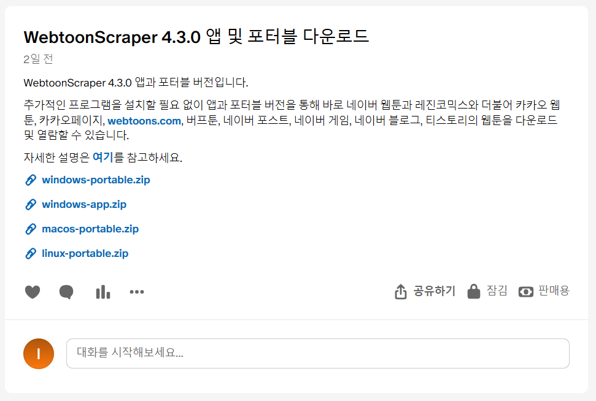
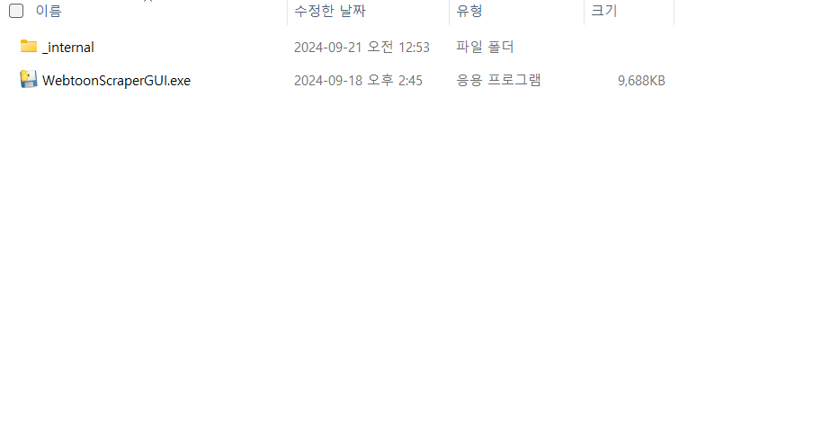
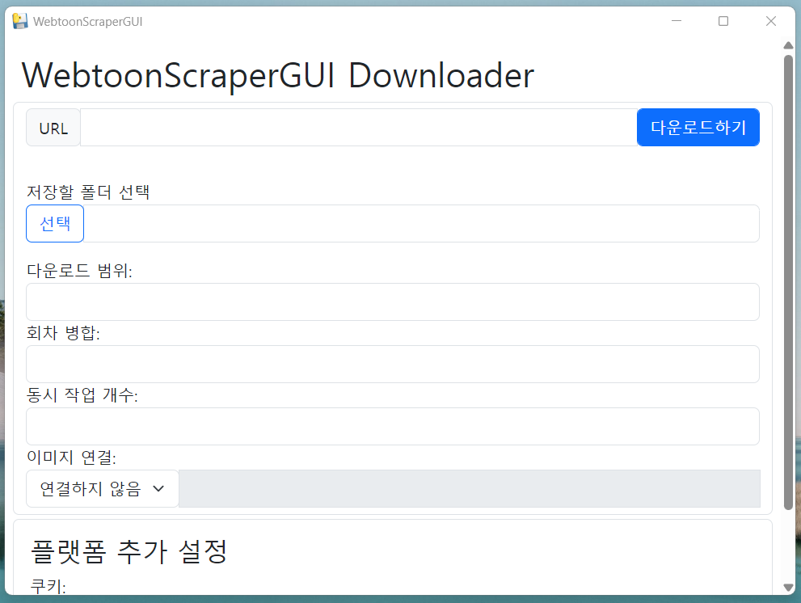
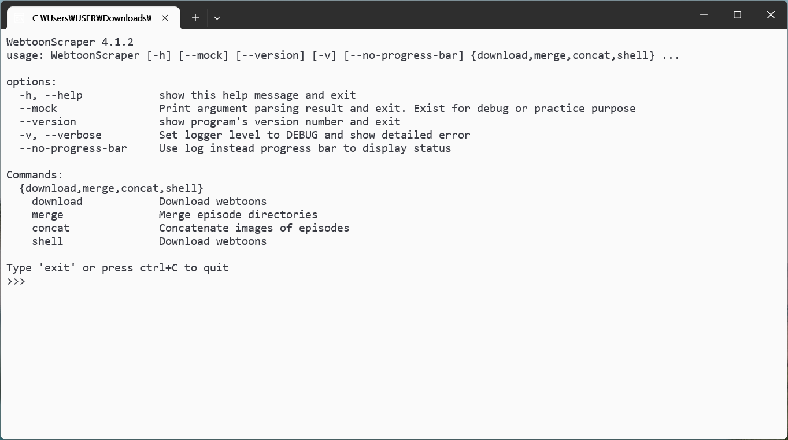

# 설치

## PyPI 패키지

파이썬을 설치한 후 다음의 명령어를 작성하세요.

```console
pip install WebtoonScraper
```

이러면 설치가 끝납니다. 설치가 제대로 되었는지 확인하려면 다음의 명령어로 확인해 보세요.

```console
webtoon --version
```

## 포터블 및 앱

### 후원

[패트리온](https://www.patreon.com/ilotoki0804)에서 후원할 경우 포터블과 앱을 다운로드받으실 수 있습니다.

멤버십은 멤버십을 유지하는 동안 새 버전이 나왔을 때 바로 다운로드받을 수 있고,
포스트 구매는 일회성이지만 멤버십과 마찬가지로 요구시 일정 기간 지원을 받을 수 있습니다.

### 다운로드 및 열기

멤버십이거나 포스트를 구매하면 앱과 실행 파일이 담겨 있는 포스트를 확인하실 수 있을 겁니다.

이때 원하는 프로그램과 운영 체제를 선택하면 됩니다. 앱을 원한다면 `app`으로 끝나는 압축 파일을, 포터블을 다운로드하고 싶은 경우 `portable`로 끝나는 압축 파일을 다운로드하면 됩니다. 윈도우로 표기되어있는 프로그램은 **윈도우 10과 11에서 모두 작동**합니다.

**앱**의 경우 아직까지는 윈도우에서만 사용 가능하지만 추후에는 맥, 리눅스, 안드로이드에서도 사용할 수 있도록 계획하고 있습니다. **포터블**은 윈도우, 맥, 리눅스 모두에서 사용 가능합니다.



이제 압축 파일을 풀면 되나, 윈도우의 경우 기본 압축 해제 프로그램을 이용하면 제대로 파일이 해제되지 않는 문제가 발생할 수 있으니 압축 해제에는 [반디집(무료)](https://www.bandisoft.com/bandizip)를 사용하는 것을 권장합니다.

압축 파일을 풀면 `_internal` 폴더와 하나의 실행 파일(아래 예시의 경우 `WebtoonScraperGUI.exe`)가 보일 텐데 `_internal` 폴더는 작동하는 데에 필요하지만 딱히 직접 건드릴 일은 없습니다. 중요한 것은 해당 실행 파일로, 해당 실행 파일을 열어주세요.

윈도우의 경우 "Windows의 PC 보호" 창이 나타난다면 이때 "추가 정보"를 누르고 아래의 "실행" 버튼을 눌러주세요.
리눅스의 경우 `bash: ./portable: Permission denied`라고 나오며 실행이 되지 않는다면 `chmod +x ./portable`을 먼저 실행해 주세요.



아래와 같이 앱이나 터미널이 뜨면 성공입니다! 이제 사용하실 수 있습니다.





### 직접 사용하기

`./portable` 혹은 `portable.exe`에 어떠한 인자도 설정하지 않은 채 실행하면(기본) CLI 셸이 실행됩니다.
인자와 함께 실행할 경우 `webtoon` 명령어를 사용하는 것과 같은 방식으로 실행해 사용할 수 있습니다.

예를 들어 아래의 명령어는 CLI 셸과 동일하게 `<URL>`에 해당하는 웹툰을 다운로드합니다.

```console
# 윈도우에서
portable download "<url>"

# 맥과 리눅스에서
./portable download "<URL>"
```
