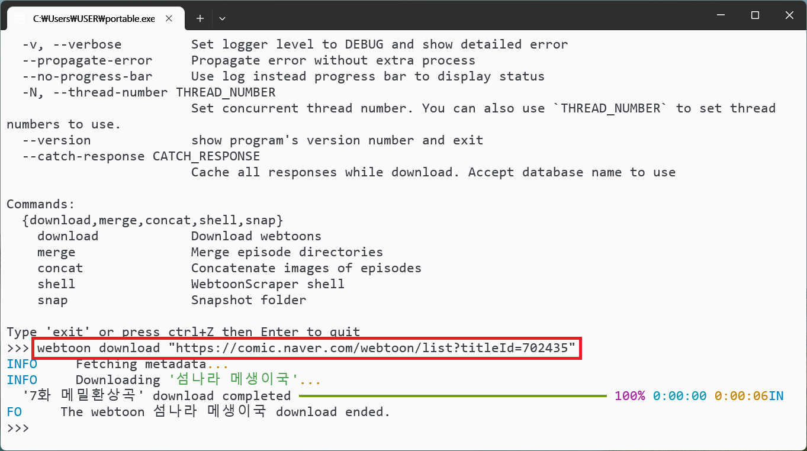
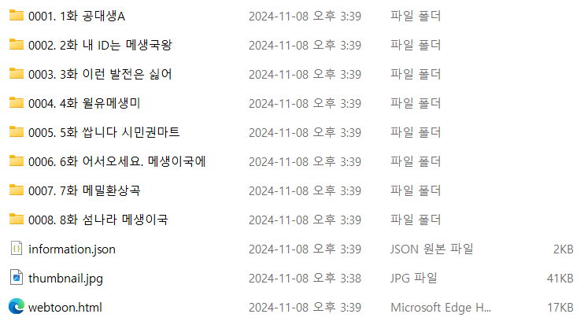

# PyPI 패키지와 포터블에서의 웹툰 다운로드

앱을 통해 다운로드하는 방법이 궁금하다면 [앱으로 웹툰 다운로드](./3-downloading-app.md)를 참고하세요.

## 다운로드

PyPI 패키지와 포터블에서는 기본적으로 다음과 같은 명령어를 통해 다운로드를 할 수 있습니다.

```console
webtoon download "https://<다운로드받을 URL>"
```


이렇게 하면 명령어가 실행된 디렉토리에서 `웹툰이름(웹툰ID)` 형식의 웹툰 디렉토리가 나타납니다.



웹툰 디렉토리 내에는 웹툰의 썸네일인 *thumbnail.jpg*, 웹툰에 관련한 정보를 담는 *information.json*,
웹브라우저에서 웹툰을 볼 수 있는 [*webtoon.html*](./viewer.md)(포터블 버전에서만 포함됨), 그리고 가장 중요한 웹툰 이미지 파일들을 담은 여러 폴더(에피소드 디렉토리라고 부르겠습니다.)들이 있습니다.


## 쿠키

위의 방식으로는 무료이며 비로그인으로도 조회할 수 있는 에피소드를 다운로드할 수 있습니다.
네이버 웹툰의 경우에는 이 정도로도 대부분의 웹툰을 다운로드할 수 있겠지만 

각 플랫폼의 쿠키에 대한 사양은 [플랫폼 문서](./platforms.md)를 참고하세요.

## 다시 다운로드하기

웹툰을 다운로드한 뒤 시간이 지나 에피소드를 업데이트하고 싶을 수 있습니다.
그럴 때는 웹툰 디렉토리를 그대로 둔 상태로 같은 URL에 대해 다운로드를 시도하세요.

그렇게 하면 기존에 다운로드한 디렉토리를 그대로 둔 상태로 새롭게 나타난 웹툰들만 다운로드할 수 있습니다.

이 동작은 `download`와 URL 사이에 `--existing-episode` 플래그를 위치시킴으로써 변형할 수 있습니다.

```console
webtoon download --existing-episode skip "https://..."
```

* `--existing-episode skip`(기본값): 웹툰 디렉토리가 발견되면 다운로드하지 않고 넘어갑니다.
* `--existing-episode raise`: 웹툰 디렉토리가 발견되면 오류를 내고 다운로드를 중단시킵니다.
* `--existing-episode download_again`: 웹툰 디렉토리가 발견되면 기존 디렉토리를 지우고 처음부터 다시 다운로드합니다.
* `--existing-episode hard_check`: 웹툰 디렉토리가 발견되면 디렉토리 내부에 있는 이미지 개수를 확인하고 실제 가져야 하는 웹툰 이미지 개수를 비교하고 일치하지 않는다면 기존 디렉토리를 지우고 처음부터 다시 다운로드합니다.

WebtoonScraper는 작동 중 오류가 나거나 예기치 않게 정지하는 상황에서도 에피소드 디렉토리의 무결성을 보장합니다.
따라서 기본값인 `skip`을 사용하는 것이 대부분의 경우 가장 좋은 선택입니다.

`hard_check`의 경우 결국 웹툰 플랫폼 서버를 거쳐야 하기 때문에 `skip`에 비해 현저하게 느리고 무결성이 보장되지도 않지만 `download_again`에 비하면 네트워크를 덜 사용합니다.
