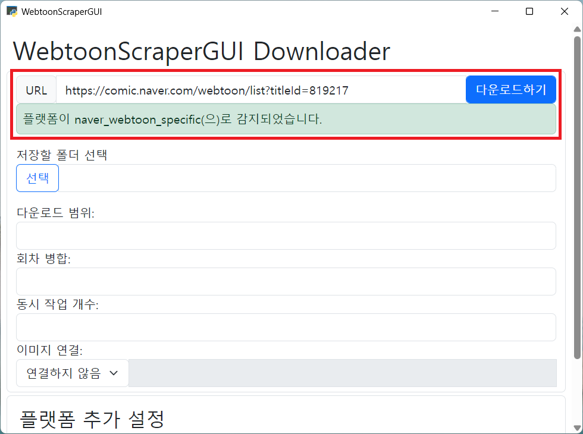
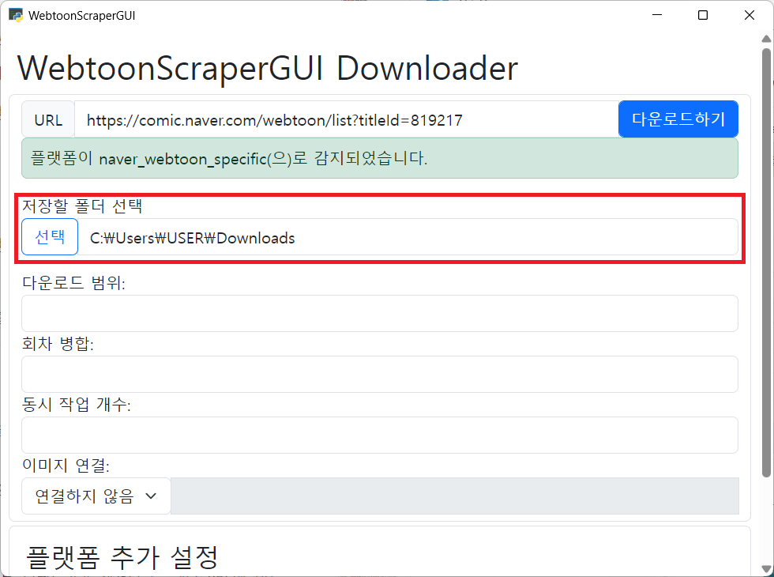
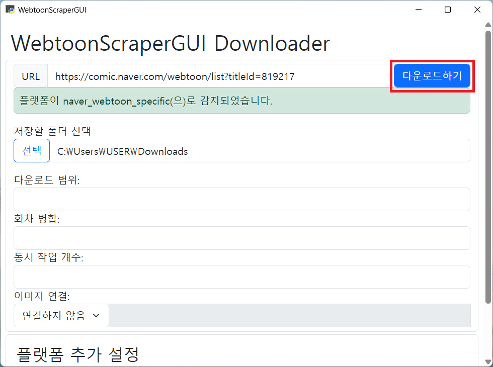
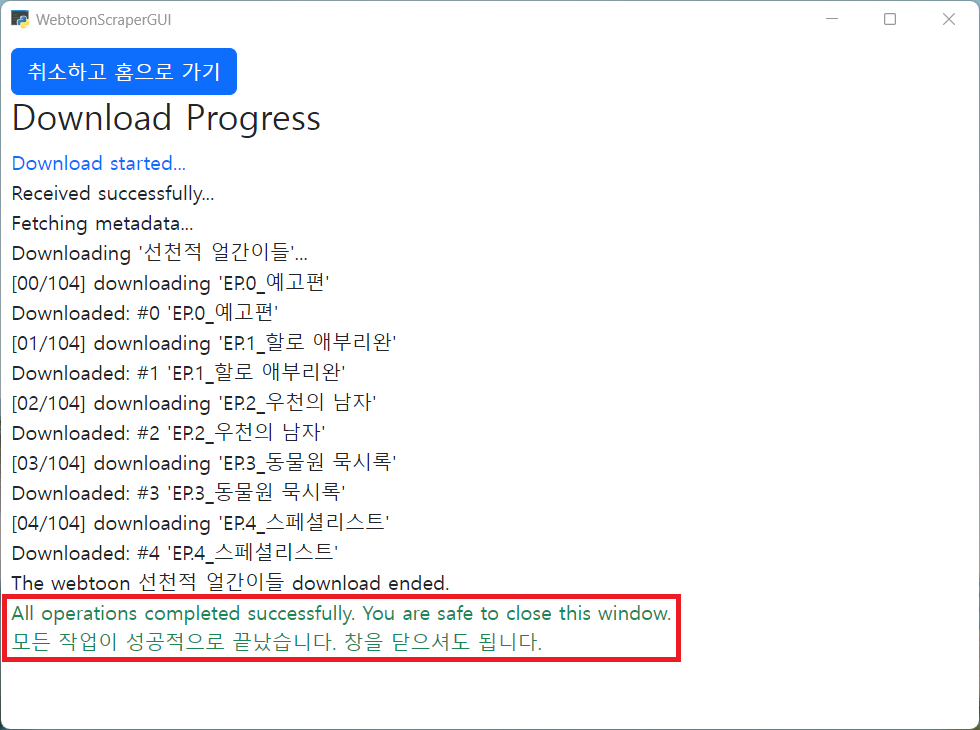
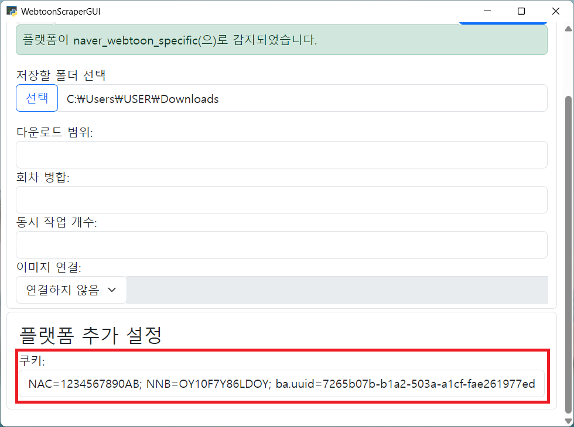
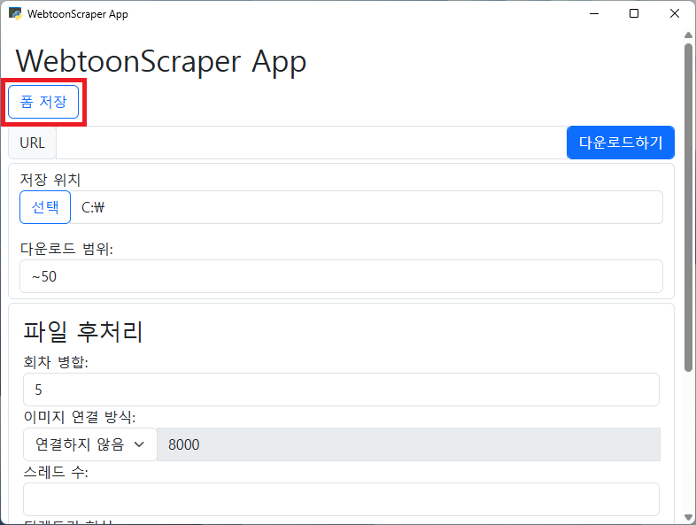
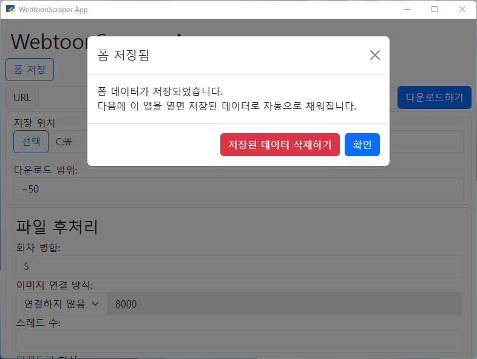

# 앱으로 웹툰 다운로드

## 웹툰 다운로드

가장 기본적으로는 맨 위에 있는 URL 필드에 원하는 웹툰의 링크를 붙여넣으면 됩니다.

이때 플랫폼이 감지되었다는 메시지가 뜬다면 제대로 작동하고 있는 겁니다.

그리고 저장할 폴더를 선택해 주어야 합니다.
웹툰을 다운로드할 디렉토리를 선택해 주세요.

이렇게 하면 다운로드할 준비는 끝났습니다!
URL 옆의 파란색 [다운로드하기] 버튼을 누르기면 됩니다.

다운로드가 끝나면 "모든 작업이 성공적으로 끝났습니다. 창을 닫으셔도 됩니다."라는 메시지가 나옵니다.
이 메시지가 나오면 작업이 종료되었으며 안전하게 나갈 수 있다는 표시입니다.

기본적으로는 여기까지만 알아도 충분하지만, 일부 웹툰은 쿠키라는 추가적인 설정이 필요할 수도 있습니다.

## 쿠키

쿠키는 일종의 웹사이트에서 보여주는 증명서입니다.
이 증명서를 통해 웹사이트는 요청을 보내는 것이 어떤 사용자인지와 같은 정보를 파악할 수 있습니다.

따라서 웹툰을 열람하는 데에 로그인이 필요하다면, 쿠키를 복사해 앱에 붙여넣어 웹툰을 다운로드할 수 있습니다.

쿠키는 맨 아래의 [플랫폼 추가 설정]란에서 입력할 수 있습니다.

모든 플랫폼에서 쿠키가 필요한 것은 아닙니다.
대표적으로 네이버 웹툰의 경우 성인 웹툰이 아니면 다운로드에 쿠키를 필요로 하지 않습니다.

다음은 쿠키가 필요한 플랫폼들만 정리한 표입니다.
여기에 나와 있는 플랫폼들은 특정한 경우에 쿠키를 요구합니다.

| 플랫폼 | 필요 여부 | 비고 |
|--|--|--|
| 네이어 웹툰 | 성인 웹툰의 경우 필요 | |
| 레진코믹스 | 성인 웹툰의 경우 필요 | 특별히 쿠키 외에 bearer가 요구됩니다. [이 내용](10-platforms.md#레진코믹스-bearer)을 참고하세요 |
| 버프툰 | 필요 | |
| 카카오 웹툰 | 성인 웹툰과 대여 및 구매한 웹툰의 경우 필요 | |
| 투믹스 | 필요 | |

### 쿠키 얻기

쿠키를 얻는 방법은 다음과 같습니다.

1. 원하는 **웹툰 플랫폼으로 가서 로그인**하세요.
1. **`f12`를 누르고** `ctrl+R`을 눌러 **새로고침**하세요.
1. `Network` 혹은 `네트워크` 탭으로 가서 제일 **처음에 있는 요청**을 누르세요.
1. 아래로 스크롤에서 `request header` 혹은 `요청 헤더`를 찾은 뒤 그 아래에 **`Cookie:`라고 되어 있는 부분을 찾으세요**.
1. 모든 내용을 복사하세요. 그게 쿠키입니다.

### 디렉토리 이름 설정

디렉토리의 이름이 설정되는 방식을 변경할 수 있습니다.
자세한 내용은 [이 문서](./11-directory-name.md)를 참고하세요.

## 폼 저장하기

앱을 열 때마다 항상 같은 내용을 입력한다면 해당 내용이 미리 채워져 있다면 간편할 것입니다. 이때 폼 저장 버튼을 눌러 폼의 데이터를 저장할 수 있습니다.

'폼 저장'을 누르면 다음과 같은 팝업이 뜹니다. 만약 저장된 데이터를 삭제하고자 한다면 '저장된 데이터 삭제하기' 버튼을 눌러 데이터를 초기화할 수 있고, '확인'을 누르거나 화면의 다른 아무 곳이나 클릭해 팝업을 닫으면 폼 데이터가 저장됩니다.

이렇게 저장된 데이터는 다음에 WebtoonScraper를 열었을 때도 그대로 보존됩니다.

## 웹툰 감상하기

**주의**: 아래에서 추천하는 앱은 홍보의 일환이 **아닙니다**. 단순히 개인적인 추천일 뿐이며 앱의 사용에 대해 개발자는 어떠한 것도 보증하지 않습니다.

다운로드받은 웹툰 파일은 웹툰 뷰어를 통해 감상할 수 있습니다.

안드로이드의 경우에는 [마루](https://play.google.com/store/apps/details?id=my.geulga)를 사용하는 것을 추천드립니다.
다만 기본으로 이미지 보기가 페이지 만화를 염두에 두고 기본값이 설정되어 있기 때문에 웹툰을 사용하려면 설정을 조금 수정해야 합니다.

iOS의 경우 [Webtoon Reader](https://apps.apple.com/kr/app/webtoon-reader/id1493951523?platform=iphone)를 사용하는 것을 추천드립니다. 다만 페이지를 다시 불러올 때 로드되는 위치가 읽기를 멈췄던 실제 위치와 상당히 괴리가 있어 불편할 수 있습니다.

PC의 경우에는 웹툰을 다운로드할 때 기본으로 같이 만들어지는 `webtoon.html` 파일을 이용하면 좋습니다.
`webtoon.html` 파일을 더블클릭하면 웹브라우저에서 해당 웹툰에 대한 웹툰 뷰어가 열립니다.
