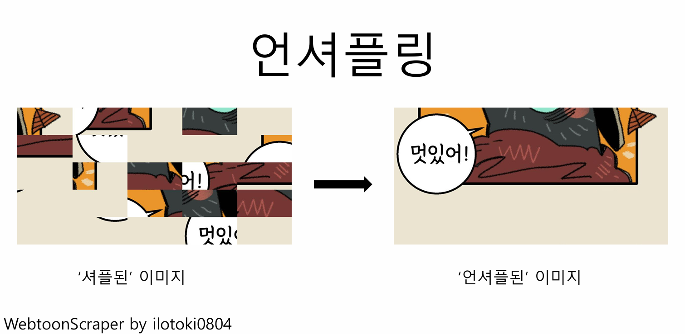

# 플랫폼별 사용법

## 웹툰 플랫폼 지원 현황 한눈에 보기

WebtoonScraper는 다양한 웹툰 플랫폼에서 다운로드를 제공합니다.

| 플랫폼명 | 무료 회차 | 성인 웹툰 | 유료 회차 |
|--|--|--|--|
| **네이버 웹툰(PyPI 제공)** | O | O | X |
| **카카오 웹툰** | O | O | O |
| **레진코믹스(PyPI 제공)** | O | O | O |
| **카카오페이지** | O | ? | O |
| **webtoons.com** | O | O | X |
| **리디북스 웹툰** | O | ? | O |
| **투믹스** | O | X | ? |
| **버프툰** | O | ? | O |
| **이만배** | O | - | O |
| **네이버 포스트** | O | - | - |
| **네이버 게임** | O | - | - |
| **네이버 블로그** | O | - | - |
| **티스토리** | O | - | - |

유료 회차에는 24시간 무료나 3다무와 같은 시간이나 이용권을 사용해서 열리는 경우도 포함됩니다.

해당 표에서 `?`으로 표기되어 있는 부분은 **해당 내용이 아직 확인되지 않았다는 의미**입니다.
만약 해당 필드를 직접 확인했다면 알려주세요. 업데이트하거나 작동하도록 수정하겠습니다.

해당 표에서 `-`으로 표기되어 있는 부분은 해당 플랫폼에서 **해당 사항이 없다는 의미**입니다.
예를 들어 네이버 포스트의 경우 유료 회차를 별도로 지정할 수 있는 시스템이 애초에 없습니다.
따라서 네이버 포스트의 유료 회차 파트는 `-`으로 표기되어 있습니다.

## 네이버 웹툰

**네이버 웹툰·베스트 도전·도전만화 무료 웹툰 다운로드 가능, 성인 웹툰의 경우 쿠키 필요, 유료·매일+ 웹툰 다운로드 불가**

[웹사이트](https://comic.naver.com/index) | 예시 URL: <https://comic.naver.com/webtoon/list?titleId=769209>

네이버 웹툰 앱에서 `공유하기`를 통해 링크를 복사할 경우 `naver.me` 단축 URL로 공유되는데, 이 링크로도 다운로드가 가능합니다.

성인 웹툰의 경우 쿠키를 적용시켜야 합니다 [쿠키 문서](./04-cookie.md)를 참고해 쿠키를 복사해 적용하세요.

유료 웹툰과 매일+ 웹툰의 경우 다운로드가 불가능합니다.

네이버 웹툰의 성인 웹툰을 다운로드받기 위해선 쿠키가 필요합니다. 쿠키를 얻는 방법은 [cookie 문서](./04-cookie.md)를 확인하세요.

### 네이버 웹툰의 추가 인자

다음은 네이버 웹툰에서 사용할 수 있는 옵션들입니다. 추가 인자에 대한 설명은 [이 문서](02-downloading-cli.md#--option-인자)를 확인하세요.

* `download-comments` (기본값 false): 해당 회차의 베스트 댓글을 불러옵니다.
* `download-all-comments` (기본값 false): 해당 회차의 모든 댓글을 '시간순으로' 불러옵니다. 이 기능은 댓글이 많을 경우 다운로드에 오랜 시간이 걸릴 수 있고 추천순으로 정렬할 수 *없으니* 주의하세요. `download-comments`와 같이 설정될 경우 `download-all-comments`가 우선권을 받아 모든 댓글을 다운로드합니다.
* `download-audio` (기본값 true): 해당 회차에 bgm이 있을 경우 다운로드합니다. bgm은 [webtoon.html 뷰어](93-how-to-view.md)에서 틀 수 있습니다. 기본으로 켜져 있기 때문에 일반적으로는 설정할 필요가 없습니다.

이 옵션들은 다음과 같이 사용할 수 있습니다.

```
webtoon download --option download-comments="true" --option download-all-comments="false" --option download-audio="false" "https://comic.naver.com/webtoon/list?titleId=769209"
```

## 카카오웹툰

**유·무료·성인 웹툰 다운로드 가능, 유료·성인 웹툰의 경우 쿠키 필요**

[웹사이트](https://webtoon.kakao.com/) | 예시 URL: <https://webtoon.kakao.com/content/%EB%82%98-%ED%98%BC%EC%9E%90%EB%A7%8C-%EB%A0%88%EB%B2%A8%EC%97%85/2320>

카카오페이지는 [별도의 가이드](#카카오페이지)를 참고하세요.

앱에서는 별도의 명령어 사용 없이 사용할 수 있으며

## 레진코믹스

**유·무료·성인 웹툰 다운로드 가능, 다운로드 시 bearer(후술) 필요, 성인 웹툰의 경우 쿠키 필요**

[웹사이트](https://www.lezhin.com/ko) | 예시 URL: <https://www.lezhin.com/ko/comic/dr_hearthstone>

레진코믹스 성인 웹툰을 다운로드받기 위해선 쿠키가 필요합니다. 쿠키를 얻는 방법은 [쿠키 문서](./04-cookie.md)를 확인하세요.

### 레진코믹스 다운로드 방법

다운로드 방식은 다음과 같습니다.

우선 아래 [레진코믹스 bearer](#레진코믹스-bearer) 단락에서 bearer를 찾아서 복사해 저장해 놓습니다.
그런 다음 *성인 웹툰의 경우* [cookie 문서](./04-cookie.md)를 참고해 쿠키도 복사해 놓습니다.

(앱의 경우) 앱에서 웹툰의 URL을 붙여넣으면 아래 '플랫폼 추가 설정' 칸에 bearer와 쿠키 입력창이 드러납니다. 앞에서 복사한 값을 붙여넣고 (성인 웹툰이 아닌 경우 쿠키는 입력할 필요가 없습니다.) 다운로드 버튼을 누릅니다.

(CLI인 경우) 다음의 명령어를 입력합니다:

```
webtoon download --option bearer="<bearer 값>" --cookie "<쿠키>" "<웹툰 URL>"
```

만약 쿠키가 필요하지 않은 비성인 웹툰의 경우 `cookie` 항목을 제외하고 명령어를 입력합니다:

```
webtoon download --option bearer="<bearer 값>" "<웹툰 URL>"
```

### 레진코믹스 bearer

레진코믹스는 자신의 계정의 데이터를 사용하기 위해선 bearer를 얻어 앱이나 포터블에서 사용해야 합니다.
bearer를 얻는 방법은 다음과 같습니다.

1. [이 링크](https://htmlpreview.github.io/?https://github.com/ilotoki0804/WebtoonScraper/blob/main/docs/get-bearer.html)로 가세요(아직은 가지 마시고 설명을 좀 더 들으세요).
1. 해당 웹페이지에 링크가 하나 있을 텐데, 그 링크를 북마크바로 드래그하세요. 만약 북마크바가 보이지 않을 시 `ctrl+shift+B`를 이용해 보이게 하세요. 그러면 북마크에 `get bearer`라는 이름의 북마크가 하나 생성이 될 것입니다.
1. [이 링크](https://www.lezhin.com/ko/help#?faq=common&notice=serial)(메인 페이지에서는 사용할 수 없으니 꼭 이 링크로 가세요!)로 간 뒤 **로그인하세요**.
1. 해당 북마크를 클릭하세요.
1. 그러면 `here is the bearer string`이라는 안내 메시지와 함께 아래에 bearer가 뜰 것입니다. 복사하세요.

`LEZHIN_BEARER` 환경 변수를 설정할 경우 해당 값을 이용합니다.

### 언셔플링



레진코믹스의 일부 웹툰에는 셔플링이 적용되어 있습니다.
셔플된 이미지는 25개로 분할되어 무작위로 섞여 있습니다.
이때 섞인 이미지를 사람이 볼 수 있는 형태로 전환하는 데에 연셔플링이 활용됩니다.

언셔플링은 웹툰 다운로드가 완료되는 동시에 **자동으로** 진행됩니다.
이 작업은 시간이 오래 걸리고 컴퓨팅 파워를 많이 사용합니다.
따라서 기기가 버벅일 수 있으며 끝날 때까지 침착하게 기다려야 합니다.

언셔플링을 하던 도중에 갑작스럽게 종료되거나 언셔플이 미처 진행하지 못하고 웹툰 다운로드가 종료되었더라도 너무 걱정하실 필요는 없습니다.
그저 다시 동일한 명령어로 다운로드를 다시 진행시키면 빠르게 언셔플이 재개됩니다.

언셔플링이 끝나면 `웹툰 이름(웹툰 id, shuffled)`로 되어 있는 웹툰 파일과 `웹툰 이름(웹툰 id)`로 되어 있는 웹툰 파일 두 개가 생성되는데, 그중에서 `shuffled`가 붙지 **않은** 쪽이 정상(언셔플된) 웹툰 파일입니다.

### 레진코믹스의 추가 설정

* `bearer` (**필수**): bearer 값을 입력합니다.
* `unshuffle` (기본값: true): 웹툰이 셔플되어 있을 때 언셔플합니다.
* `delete-shuffled` (기본값: false): 웹툰 언셔플이 끝나면 셔플된 파일을 삭제합니다.
* `download-paid` (기본값: true): 유료 회차도 다운로드를 시도합니다.
* `thread-number` (기본값: default): 언셔플 시 사용할 스레드 개수를 설정합니다. `default`로 설정할 경우 CPU의 전체 스레드 개수의 절반을 언셔플 시에 사용합니다. 단, `default`이더라도 스레드 개수의 절반이 1보다 작을 경우 1로, 10보다 큰 경우 10으로 고정합니다.

## 카카오페이지

**유·무료 웹툰 다운로드 가능, 유료 웹툰의 경우 쿠키 필요**

[웹사이트](https://page.kakao.com/) | 예시 URL: <https://page.kakao.com/content/53397318>

## 이만배

[웹사이트](https://www.emanbae.com/) | 예시 URL: <https://www.emanbae.com/series/13>

### 이만배 다운로드 방법

다운로드 방식은 다음과 같습니다.

우선 아래 [이만배 bearer](#이만배-bearer) 단락에서 bearer를 찾아서 복사해 저장해 놓습니다.

(앱의 경우) 앱에서 웹툰의 URL을 붙여넣으면 아래 '플랫폼 추가 설정' 칸에 쿠키 입력창이 드러납니다. 앞에서 복사한 값을 붙여넣고 (성인 웹툰이 아닌 경우 쿠키는 입력할 필요가 없습니다.) 다운로드 버튼을 누릅니다.

(CLI인 경우) 다음의 명령어를 입력합니다:

```
webtoon download --option bearer="<bearer 값>" --cookie "<쿠키>" "<웹툰 URL>"
```

만약 쿠키가 필요하지 않은 비성인 웹툰의 경우 `cookie` 항목을 제외하고 명령어를 입력합니다:

```
webtoon download --option bearer="<bearer 값>" "<웹툰 URL>"
```

### 이만배 bearer

이만배는 자신의 계정의 데이터를 사용하기 위해선 bearer를 얻어 앱이나 포터블에서 사용해야 합니다.
bearer를 얻는 방법은 다음과 같습니다.

1. [이 링크](https://htmlpreview.github.io/?https://github.com/ilotoki0804/WebtoonScraper/blob/main/docs/get-bearer-emanbae.html)로 가세요(아직은 가지 마시고 설명을 좀 더 들으세요).
1. 해당 웹페이지에 링크가 하나 있을 텐데, 그 링크를 북마크바로 드래그하세요. 만약 북마크바가 보이지 않을 시 `ctrl+shift+B`를 이용해 보이게 하세요. 그러면 북마크에 `get bearer`라는 이름의 북마크가 하나 생성이 될 것입니다.
1. [이만배 홈페이지](https://www.emanbae.com/)(메인 페이지에서는 사용할 수 없으니 꼭 이 링크로 가세요!)로 간 뒤 **로그인하세요**.
1. 해당 북마크를 클릭하세요.
1. 그러면 `here is the bearer string`이라는 안내 메시지와 함께 아래에 bearer가 뜰 것입니다. 복사하세요.

`EMANBAE_BEARER` 환경 변수를 설정할 경우 해당 값을 이용합니다.
