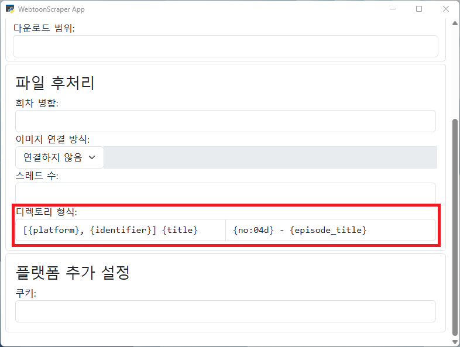

# 디렉토리 이름 설정

**주의**: 이 기능을 사용하면 다른 WebtoonScraper의 기능들이 예기치 않게 오작동할 여지가 있습니다. 다운로드 시 항상 일관된 형식을 사용한다면 문제를 최소화할 수 있습니다.

WebtoonScraper는 기본적으로 웹툰을 다운로드할 때 `웹툰 제목(웹툰 ID)`의 형식으로 된 웹툰 디렉토리에 `0000. 회차 이름`의 형식으로 된 회차 디렉토리가 있는 방식으로 저장됩니다.

## CLI에서의 사용법

`--webtoon-dir-name`을 설정하면 웹툰의 이름을 커스텀으로 설정할 수 있습니다.

예를 들어 `--webtoon-dir-name "내 웹툰"`으로 설정할 경우 기존의 `웹툰 제목(웹툰 ID)` 형식의 웹툰 폴더 대신 `내 웹툰`에 웹툰이 저장됩니다.

이때 일종의 변수를 사용해 자동으로 WebtoonScraper가 값을 채우도록 할 수 있습니다. 이를테면, `{title}` 변수는 웹툰의 이름으로 치환됩니다.
즉, `--webtoon-dir-name "다운로드된 {title}"`으로 설정할 경우 웹툰 이름이 `외모지상주의`라면 `다운로드된 외모지상주의`와 같이 이름이 설정됩니다.
웹툰 디렉토리의 형식을 변경할 경우 발생할 수 있는 문제는 제한적이나, `merge` 커맨드의 `--select` 커맨드에서는 웹툰 디렉토리를 정확하게 인식하지 못할 수 있습니다.

에피도드 디렉토리의 이름을 설정하는 `--episode-dir-name` 파라미터의 경우에도 동일합니다.
예를 들어 `--episode-dir-name "{no}. {episode_title}"`과 같이 설정할 경우 현재 형식과 비슷하게 `1. 에피소드 이름`과 같이 에피소드 디렉토리가 생성됩니다.
이 기능을 사용하여 에피소드 디렉토리의 형식을 변경할 경우 레진코믹스에서 언셔플하는 경우, `existing-episode` 정책이 `hard_check`로 되어 있는 경우 등 디렉토리 이름의 형식에 의존하는 기능들은 제대로 동작하지 않거나 오류를 발생시킬 수 있습니다. 이는 미래에 작동하도록 변경될 수 있습니다.

## 앱에서의 사용법



앱에서는 `디렉토리 형식`란을 수정해서 디렉토리 형식을 변경할 수 있습니다. 왼쪽의 칸은 웹툰 디렉토리, 오른쪽의 칸은 에피소드 디렉토리의 형식을 설정합니다.

별도로 설정하지 않을 경우 기본값으로 그대로 진행되며, 둘 중 하나는 설정하고 하나는 기본값으로 둘 수도 있습니다.

## 디렉토리 변수들

웹툰 디렉토리에서 변수로 사용할 수 있는 것들은 다음과 같습니다.
변수명 뒤에 괄호로 오는 값은 해당 변수의 타입입니다.

* `title (str)`: 웹툰의 이름입니다.
* `identifier (str)`: 웹툰을 인식할 수 있는 고유한 ID입니다. 웹툰 ID와 비슷하지만 튜플 대신 문자열로 여러 값을 표현합니다.
* `webtoon_id`: 웹툰 ID 자체입니다. identifier의 경직된 사용성이 싫다면 유연하게 사용할 수 있습니다.
* `author (str)`: 해당 웹툰의 작가입니다.
* `platform (str)`: 해당 웹툰 플랫폼의 고유한 코드입니다. 예를 들어 네이버 웹툰은 `naver_webtoon`, 레진 코믹스는 `lezhin_comics`입니다.
* `datetime (datetime)`: 해당 웹툰이 생성되는 때의 `datetime` 객체입니다. [다음의 포맷](https://docs.python.org/ko/3/library/datetime.html#format-codes)을 활용해서 원하는 형식으로 설정할 수 있습니다.
* `date (str)`: 해당 웹툰이 생성되는 날입니다. `{datetime:%Y-%m-%d}`과 동일합니다.
* `time (str)`: 해당 웹툰이 생성되는 시간대입니다. `{datetime:%H:%M:%S}`과 동일합니다.

웹툰 디렉토리의 기본 포맷은 `{title}({identifier})`입니다.

에피소드 디렉토리에서 사용할 수 있는 변수는 다음과 같습니다.

* `no (int)`: 에피소드의 번째수입니다.
* `no0 (int)`: `no`와 같지만 1부터 시작하는 `no`와 달리 0부터 시작합니다.
* `episode_title (str)`: 해당 에피소드의 이름입니다.
* `title (str)`: 웹툰의 이름입니다.
* `webtoon_id`: 웹툰 ID 자체입니다. identifier의 경직된 사용성이 싫다면 유연하게 사용할 수 있습니다.
* `author (str)`: 해당 웹툰의 작가입니다.
* `platform (str)`: 해당 웹툰 플랫폼의 고유한 코드입니다. 예를 들어 네이버 웹툰은 `naver_webtoon`, 레진 코믹스는 `lezhin_comics`입니다.
* `datetime (datetime)`: 해당 에피소드가 생성되는 때의 `datetime` 객체입니다. [다음의 포맷](https://docs.python.org/ko/3/library/datetime.html#format-codes)을 활용해서 원하는 형식으로 설정할 수 있습니다.
* `date (str)`: 해당 에피소드가 생성되는 날입니다. `{datetime:%Y-%m-%d}`과 동일합니다.
* `time (str)`: 해당 에피소드가 생성되는 시간대입니다. `{datetime:%H:%M:%S}`과 동일합니다.

에피소드 디렉토리의 기본 형식은 `{no:04d}. {episode_title}`입니다.

## 디렉토리 형식 설정 응용

디렉토리 이름을 설정할 때는 파이썬의 기본 포맷 방식은 `str.format()`을 사용합니다. 상세한 포맷 응용법은 [파이썬 문서](https://docs.python.org/ko/3.13/library/string.html#format-examples)에서 확인할 수 있지만 중요한 내용들은 여기에서 모두 설명해 드리겠습니다.

기본적으로 변수는 `{variable}`의 형태로 표현되고, 변수에 형식을 변경할 때는 `{variable:format}`의 형식으로 변수명의 오른쪽에 `:format`을 덧붙여 변형합니다.

변수 중 **정수**는 `{no:04d}`와 같이 `0Nd`의 형식으로 설정하면 앞에 0을 padding할 수 있습니다. 예를 들어 `no` 변수의 값이 `42`일때 `{no:04d}`는 `0042`로 변환됩니다.

변수 중 **문자열**은 정렬을 설정할 수 있습니다. 이때 순서대로 채움 문자, `</^/>`(각각 왼쪽, 가운데, 오른쪽 정렬), 문자 총 길이, 이렇게 세 가지 요소가 잇다라 이어지는데,
예를 들어 `{title: <30}`과 같이 설정하면 *채움 문자를 스페이스로 하는 왼쪽으로 30글자 정렬*을 의미하게 됩니다.

변수 중 **datetime**은 날짜와 시간을 원하는 형식으로 설정할 수 있습니다. 자세한 형식은 해당 [파이썬 문서](https://docs.python.org/ko/3/library/datetime.html#format-codes)에서 찾을 수 있습니다만 몇 가지 예시를 들면 오늘이 2025년 3월 3일 10시 10분이라면 `{datetime:%Y-%m-%d}`은 `2025-03-03`으로 변환되고 `{datetime:%H:%M:%S}`은 `03:03:00`으로 변환됩니다. 

## 디렉토리 형식 예시

웹툰 디렉토리는 다음과 같은 형식으로 설정할 수 있습니다.

```
"{title}({identifier})"  # "독립일기(748105)"
"[{author}] {title}({platform}_{identifier})"  # "[자까] 독립일기(naver_webtoon_748105)"
"[{platform}, {identifier}] {title} at {datetime:%y%m%d}"  # "[naver_webtoon, 748105] 독립일기 at 250303"
```

에피소드 디렉토리는 다음과 같이 설정할 수 있습니다.

```
"{no:04d}. {episode_title}"  # "0002. 1화 나도 혼자 산다"
"{no:03d} - {episode_title}"  # "002 - 1화 나도 혼자 산다"
"{no0:04d}. {datetime:%m%d} {episode_title}"  # "001. 1010 나도 혼자 산다"
```
