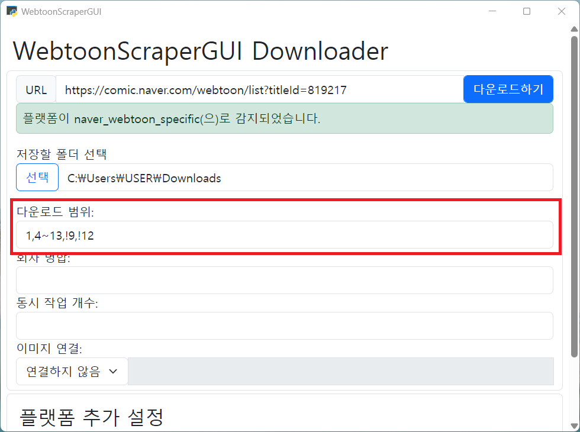

# 다운로드 범위 지정

다운로드 시에는 일부 회차는 다운로드하고 싶지 않을 수 있습니다.
그럴 때에는 다운로드 범위를 지정해 일부 회차를 다운로드에서 제외할 수 있습니다.

그러나 다운로드한 회차를 다시 다운로드받지 않는 것이 주된 목적이라면 굳이 범위를 지정할 필요가 없습니다. WebtoonScraper는 충분히 똑똑해서 이미 다운로드한 회차를 빠르게 스킵할 수 있기 때문입니다.

다운로드 범위 지정에는 기본적으로 자연수를 콤마로 나누어 나열합니다.

```
# 1, 4, 5, 6, 7, 8, 10, 11, 13화를 다운로드
1,4,5,6,7,8,10,11,13
```

## 범위 다운로드

다운로드할 모든 회타를 열거하는 대산 `~`를 이용해 해당 범위 내의 회차를 다운로드할 수 있습니다.

```
# 1, 4화부터 8화까지, 10, 11, 13화를 다운로드
1,4~8,10,11,13
```

이때 `~`의 양쪽 끝은 생략할 수 있습니다. 왼쪽을 생략하면 처음부터(1을 쓴 것과 같습니다), 오른쪽을 생략하면 끝까지 다운로드합니다.

```
# 1화부터 15화까지, 20화부터 끝까지 다운로드
~15,20~
```

## 회차 제외

다운로드하지 않을 회차를 특정하는 방법을 이용할 수도 있습니다.
다운로드하지 않을 회차는 `!`을 앞에 붙여 표현하며, 오른쪽에 있는 값이 더 우선권을 갖습니다.

```
# 1, 4화부터 13화까지 다운로드하되 9화와 12화는 제외
1,4~13,!9,!12
```

원한다면 아예 다운로드하지 않을 회차만 열거할 수도 있습니다.
이때는 `!`으로 범위가 시작해야 합니다.

```
# 3, 12, 16화부터 21화까지를 제외하고 모두 다운로드
!3,!12,!16~21
```

</details>

## 적용

### 패키지와 포터블

패키지와 포터블에서는 `--range`나 축약형 `-r` 플래그를 통해 다운로드 범위를 결정할 수 있습니다.
이때 사이에 공백 문자를 넣지 않도록 주의하세요.

```console
webtoon download --range !3,!12,!16~21 "https://..."
```

### 앱

앱에서는 [다운로드 범위]에 지정한 범위를 적어 적용합니다.


