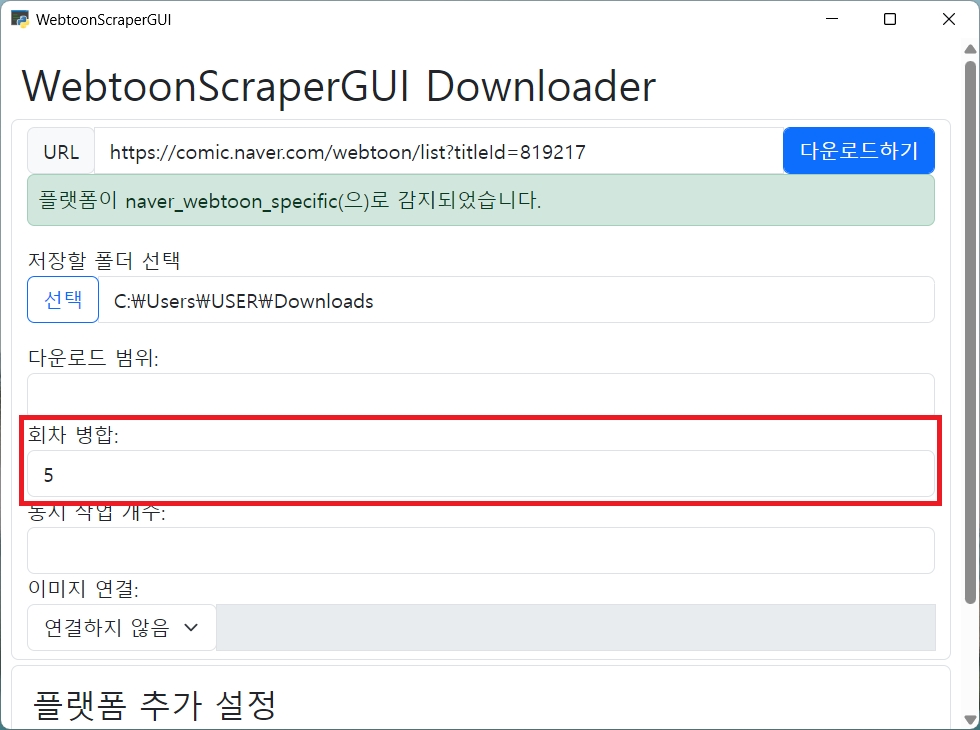

## 회차 병합

회차 병합 기능은 여러 웹툰 회차를 한 디렉토리에 담는 기능입니다.
이 기능을 사용하면 회차가 끝났을 때 다음 회차로 넘어가기 위해 추가적인 동작을 할 필요가 없으며,
특히 한 회차가 짧은 사컷만화 등의 웹툰을 더욱 편하게 볼 수 있습니다.
이 기능은 여러 이미지를 하나로 합치는 기능이 **아니며** 해당 기능은 아래의 [이미지 연결](#이미지-연결)을 참고하세요.
또한 파일을 이리저리 이동하는 것일 뿐이기에 작업에 많은 리소스가 필요하지 않습니다.

### 앱

[회차 병합]란에 수를 기입하면 웹툰 다운로드가 끝나는 동시에 회차 병합이 시작합니다.
회차 병합은 단순히 이미지 파일의 이름을 바꾸고 폴더를 옮기는 정도의 일이기 때문에 보통 몇 초 안에 끝납니다.



### 포터블

포터블의 경우 다운로드 시에 `-m` 플래그를 사용하시면 웹툰 다운로드가 완료된 후 디렉토리를 병합합니다.

```console
webtoon download -m 5 "https://comic.naver.com/webtoon/list?titleId=183559"
```

### 병합하고 복원하기

포터블의 `webtoon merge` 명령어를 통해서 원하는 웹툰 디렉토리를 병합하거나 병합된 상태에서 기존의 디렉토리 상태로 되돌릴 수 있습니다.

아래의 명령어를 사용해서 웹툰 디렉토리를 5회차씩 병합합니다.

```console
webtoon merge -m 5 "내 웹툰(12345)"
```

웹툰 디렉토리를 직접 치는 대신 웹툰 디렉토리의 상위 디렉토리에서 선택자를 이용해 웹툰 디렉토리를 지정할 수 있습니다.

```console
# 현재 디렉토리에서 웹툰 디렉토리 검색
webtoon merge . -s
```

이미 병합된 웹툰 디렉토리를 기본 상태로 되돌리고 싶을 때도 같은 명령어를 사용하시면 됩니다.

```console
# 이미 병합됩 웹툰 디렉토리라면 복원함
webtoon merge "내 웹툰(12345)"
```

만약 병합할지 복원할지 정확하게 지정하고 싶다면 `--action(-a)` 플래그를 사용하시면 됩니다.

```console
# 웹툰 디렉토리를 병합함. -a 플래그가 꼭 필요하지는 않음
webtoon merge -m 5 -a merge "내 웹툰(12345)"
# 웹툰 디렉토리를 복원함. -a 플래그가 꼭 필요하지는 않음
webtoon merge -a restore "내 웹툰(12345)"
```

### 참고 사항

[마루 뷰어를 사용](#웹툰-감상하기)하는 경우 회차 병합은 5화 정도가 적당합니다.
