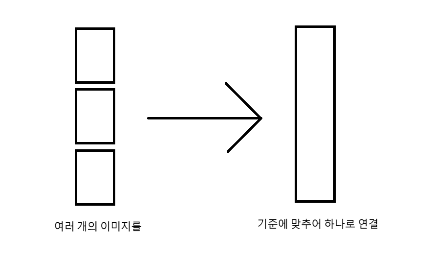

# 이미지 연결

이미지 병합은 한 회차의 이미지들을 적당한 개수로 묶어 하나의 이미지로 연결하는 기능입니다.

이미지 병합 시에 하나로 묶을 이미지의 개수를 결정하는 데에는 다양한 방식이 있습니다.

| 병합 방식 | 설명 |
| -- | -- |
| 세로 픽셀 수 | 이미지의 전체 세로 픽셀 수가 해당 값 이상이 되도록 설정 |
| 종횡비 | 가로 / 세로의 비. 실수도 가능 |
| 이미지 개수 | 이미지의 개수가 설정한 값이 되도록 설정 |
| 모두 결합 | 한 에피소드의 모든 이미지를 결합 |

[마루 뷰어를 사용](#웹툰-감상하기)하는 경우 세로 픽셀 수가 8000이 되도록 결합하면 로딩 속도가 눈에 띄게 향상됩니다.
